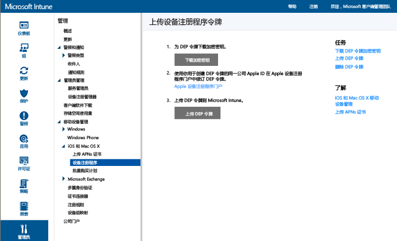

# 注册企业拥有的已加入设备注册计划的 iOS 设备

[!INCLUDE[classic-portal](../includes/classic-portal.md)]

Microsoft Intune 可以部署注册配置文件，从而注册通过设备注册计划 (DEP) 以“无线”方式购买的 iOS 设备。 注册包中包括设备的设置助理选项。

>[!NOTE]
>DEP 注册不能与[设备注册管理器](enroll-corporate-owned-devices-with-the-device-enrollment-manager-in-microsoft-intune.md)方法一起使用。
>此外，如果用户注册 iOS 设备（即 使用公司门户应用），然后导入这些设备的序列号并分配 DEP 配置文件，那么设备将在 Intune 中取消注册。

## 通过 Apple DEP 管理来注册 iOS 设备的先决条件

- [安装 APN 证书](set-up-ios-and-mac-management-with-microsoft-intune.md)

- 组织必须加入 Apple DEP 并通过此计划购买设备。 该过程的详细信息，可以通过以下网站获得：  [https://deploy.apple.com](https://deploy.apple.com)进行管理。 此计划的优势在于无需动手设置设备，不要使用 USB 线缆将每台设备与计算机相连。

- 必须先从 Apple 获得 DEP 令牌，然后才能向 DEP 注册企业拥有的 iOS 设备。 使用此令牌，Intune 可以同步企业拥有的已加入 DEP 的设备的相关信息。 它也允许 Intune 将注册配置文件上传至 Apple，并向设备分配这些配置文件。

## 如何通过 Apple DEP 管理来注册 iOS 设备

下面介绍了使用 Apple DEP 管理当天注册 iOS 设备的步骤。 随着组织添加和删除设备，你可能需要重复执行下面的一些步骤，如添加或删除序列号，如下所述。

### 获取加密密钥

1. 以管理用户身份打开 [Microsoft Intune 管理控制台](https://manage.microsoft.com)，依次转到“管理”&gt;“移动设备管理”&gt;“iOS”&gt;“设备注册计划”，然后选择“下载加密密钥”。

2. 在本地保存加密密钥(.pem)文件。 .pem 文件用于从 Apple 设备注册计划门户请求信任关系证书。

### 获取设备注册计划令牌

1. 转到[设备注册计划门户](https://deploy.apple.com) (https://deploy.apple.com)，然后使用你的公司 Apple ID 登录。 之后必须使用此 Apple ID 才能续订 DEP 令牌。

2.  在设备注册计划门户中，依次转到“设备注册计划”&gt;“管理服务器”，然后选择“添加 MDM 服务器”。

3.  输入“MDM 服务器名称”，然后选择“下一步”。 服务器名称用于标识移动设备管理 (MDM) 服务器，以供你参考。 并不是 Microsoft Intune 服务器的名称或 URL。

4.  此时，“添加 &lt;服务器名称&gt;”对话框打开。 选择“选择文件…” 以上载 .pem 文件，然后选择“下一步”。

5.  此时，“添加 &lt;服务器名称&gt;”对话框显示“你的服务器令牌”链接。 将服务器令牌 (.p7m) 文件下载到计算机中，然后选择“完成”。

   此证书(.p7m)文件用于在 Intune 和 Apple 的设备注册计划服务器之间建立信任关系。

### 将 DEP 令牌添加到 Intune

1. 在 [Microsoft Intune 管理控制台](https://manage.microsoft.com)中，依次转到“管理”&gt;“移动设备管理”&gt;“iOS”&gt;“设备注册计划”。

2. 选择“上载 DEP 令牌”。 **转到**证书 (.p7m) 文件，输入你的 **Apple ID**，然后选择“上载”。

### 添加企业设备注册策略

1. 在 [Microsoft Intune 管理控制台](https://manage.microsoft.com)中，依次转到“策略”&gt;“企业设备注册”，然后选择“添加”。

2. 输入“常规”详细信息，包括“名称”和“说明”，然后指定分配给配置文件的设备是否拥有用户关联或属于某个组：

   - **用户关联提示**：必须在初始设置过程中将设备与用户相关联，然后才能以相应用户的身份访问公司数据和电子邮件。 应为属于用户且需要使用公司门户（即需要安装应用）的受 DEP 管理设备设置“用户关联”。 在已设置用户关联的 DEP 设备上注册时，多重身份验证 (MFA) 不起作用。 注册后，MFA 可以在这些设备上如预期一样正常运作。 对于需要在首次登录时更改密码的新用户，不会在 DEP 设备上注册时看到更改密码提示。 此外，对于密码已到期的用户，系统也不会在 DEP 注册期间提示用户重置密码，必须通过其他设备重置密码。

   > [!NOTE]
   > 为了请求获取用户令牌，已设置用户关联的 DEP 要求启用 WS-Trust 1.3 用户名/混合终结点。

   - **无用户关联**：该设备不与用户关联。 将这种附属关系用于无需访问本地用户数据即可执行任务的设备。 需要用户附属关系的应用（包括用于安装业务线应用的公司门户应用）无法运行。

   还可以设置“将设备分配到以下组”。 选择“选择...”，选择一个组。

   > [!Important]
   > 组分配即将从 Intune 迁移到 Azure Active Directory 中。 在 Intune 帐户接受适用的更新后，便看不到“将设备分配到以下组”选项。 [了解详细信息](/intune/deploy-use/ios-device-enrollment-program-in-microsoft-intune#changes-to-intune-group-assignments)。

3. 然后，启用“为该策略配置设备注册计划设置”，从而支持 DEP。

      

   下列设置适用于受 DEP 管理设备：

   - 部门 - 当用户在激活过程中点击“关于配置”时显示
   - 支持电话 - 当用户在激活过程中单击“需要帮助”按钮时显示
   - 准备模式 - 在激活过程中设置，只能通过将设备重置为出厂默认设置来进行更改：
       - **无人监督** - 有限的管理功能
       - **受到监督** - 启用更多的管理选项，并默认禁用激活锁定
   - 将注册配置文件锁定到设备 - 在激活过程中设置，只能通过将设备重置为出厂默认设置来进行更改
       - **禁用** - 允许从“设置”菜单中删除管理配置文件
       - 启用 -（“准备模式”必须  = “受到监督”）禁用可删除管理配置文件的 iOS“设置”菜单选项
   - 设置助理选项 - 稍后可以在 iOS 的“设置”菜单中设置这些可选设置。
        - **密码** - 在激活过程中提示输入密码。 始终要求输入密码，除非设备受到保护或以其他某种方式（即采用将设备限定为只对应一个应用的展台模式）控制访问权限
       - **定位服务** - 如果启用，在激活过程中设置助理会提示此服务
       - **还原** - 如果启用，在激活过程中设置助理会提示进行 iCloud 备份
       - Apple ID - 启用后，当 Intune 在没有 ID 的情况下尝试安装应用时，iOS 会提示用户输入 Apple ID。 必须使用 Apple ID，才能下载 iOS App Store 应用（包括由 Intune 安装的应用）。
       - **条款和条件** - 如果启用，在激活过程中设置助理会提示用户接受 Apple 的条款和条件
       - **Touch ID** - 如果启用，在激活过程中设置助理会提示此服务
       - **Apple Pay** - 如果启用，在激活过程中设置助理会提示此服务
       - **缩放** - 如果启用，在激活过程中设置助理会提示此服务
       - **Siri** - 如果启用，在激活过程中设置助理会提示此服务
       - **向 Apple 发送诊断数据** - 如果启用，在激活过程中设置助理会提示此服务
   -  启用其他 Apple 配置器管理 - 设置为“禁止”可阻止通过 Apple 配置器与 iTunes 或管理设置同步文件。 最好选择“禁止”，从 Apple 配置器中导出其他任何配置，然后通过 Intune 部署为自定义 iOS 配置文件，而不要使用此设置允许手动部署，无论是否有证书。
       - **禁止** - 阻止设备通过 USB 进行通信（禁止配对）
       - 允许 - 允许设备通过 USB 连接与任何 PC 或 Mac 进行通信
       - 需要证书 - 允许与包含已导入注册配置文件中的证书的 Mac 配对

### 将配置文件分配给设备

1. 在 [Microsoft Intune 管理控制台](https://manage.microsoft.com)中，依次转到“策略”&gt;“企业设备注册”，然后选择“分配”。

2. 选择要向其分配已创建的配置文件的设备。 可以选择“所有设备”或特定设备，然后选择“添加”。

> [!Important]
> 目前，Intune 允许指定“默认”设备注册配置文件。也就是说，与 Apple DEP 服务同步新序列号时，新序列号会自动分配给默认配置文件。 当你的租户在不久的将来迁移到新的 Azure 门户中时，便无法再设置默认配置文件，也无法将序列号自动分配给默认配置文件。 相反，必须将序列号分配给特定的配置文件。 [了解详细信息](https://docs.microsoft.com/intune-azure/enroll-devices/enroll-ios-devices-using-device-enrollment-program)

### 分配 DEP 设备以进行管理

1. 转到 [设备注册计划门户](https://deploy.apple.com) (https://deploy.apple.com) 并使用你的公司 Apple ID 登录。

2. 依次转到“部署计划”&gt;“设备注册计划”&gt;“管理设备”。

3. 指定“选择设备”的方式，提供设备信息，并按设备“序列号”、“订单编号”或“上传 CSV 文件”指定详细信息。

4. 依次选择“分配到服务器”、为 Microsoft Intune 指定的 &lt;服务器名称&gt; 和“确定”。

### 同步 DEP 管理的设备

这一步会将设备与 Apple DEP 服务同步，让设备显示在 Intune 控制台中。

1. 以管理用户身份打开 [Microsoft Intune 管理控制台](https://manage.microsoft.com)，依次转到“管理”&gt;“移动设备管理”&gt;“iOS”&gt;“设备注册计划”，然后选择“立即同步”。 会向 Apple 发送同步请求。

2. 若要在同步后查看受 DEP 管理设备，请在 [Microsoft Intune 管理控制台](https://manage.microsoft.com)中，依次转到“组”&gt;“所有设备”&gt;“企业预注册的设备”&gt;“通过 iOS 序列号”。 在“通过 iOS 序列号”工作区中，在打开设备并运行设置助理以注册设备之前，受管理设备的“状态”一直显示为“未连接”。

   为了遵从 Apple 有关可接受 DEP 流量的条款，Intune 规定了以下限制：

   - 每七天只能运行一次完全 DEP 同步。 在完全同步期间，Intune 会刷新 Apple 分配给 Intune 的每个序列号，无论序列号之前是否同步过。 如果距离上一次完全同步不到七天就尝试运行完全同步，Intune 只会刷新 Intune 中尚未列出的序列号。

   - 任何同步请求都必须在 10 分钟内完成。 在此期间或在请求成功之前，“同步”按钮处于禁用状态。

### 将设备分发给用户

企业拥有的设备现在可以分发给用户。 打开 iOS 设备时，它将注册为由 Intune 管理。 用户设备限制适用于受 DEP 管理设备。

>[!NOTE]
>如果用户尝试注册 DEP 设备，但已超出设备限制，那么注册会失败，用户也不会收到任何警告。

## Intune 组分配变化

自 2017 年 4 月起，设备组管理将移到 Azure Active Directory 中。 过渡到 Azure Active Directory 组后，组分配将不会出现在“企业注册配置文件”选项中。 由于此更改将历时数月，因此可能不会立即发现有所变化。 迁移到新门户后，可以根据企业注册配置文件名定义动态设备组分配。

迁移后，对于所有由企业设备注册配置文件预分配的 Intune 设备组，都将根据企业设备注册配置文件名在 Azure AD 中创建相应的动态设备组。 新配置文件名的格式为：*EnrollmentProfile:&lt;相关配置文件的名称&gt;*。 此过程可确保已分配到设备组的设备在部署了策略和应用的组中自动注册。

在组迁移期间，只会这样自动创建一次组。 迁移后，Intune 管理员必须使用 Azure 门户创建组。 若要详细了解此更改对公司拥有的 iOS 设备注册造成的影响，请参阅[企业预注册的 iOS 设备的自动分组变更](https://blogs.technet.microsoft.com/intunesupport/2017/04/19/changes-to-automatic-grouping-for-corporate-pre-enrolled-ios-devices/)。

还可参阅[详细了解 Azure Active Directory 组](https://azure.microsoft.com/documentation/articles/active-directory-accessmanagement-manage-groups/)。

### 另请参阅
[注册设备的先决条件](prerequisites-for-enrollment.md)

