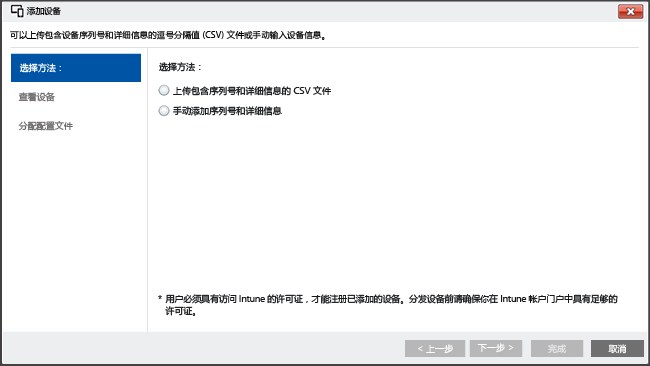

# <a name="enroll-ios-devices-with-apple-configurator-by-using-setup-assistant"></a>使用设置助理通过 Apple Configurator 注册 iOS 设备
Intune 支持注册企业所有的 iOS 设备，方法是使用在 Mac 计算机上运行的 [Apple Configurator](http://go.microsoft.com/fwlink/?LinkId=518017)。 此过程可恢复设备的出厂设置，并将其准备好以运行设置助理，从而为设备的新用户安装公司策略。

## <a name="setup-assistant-enrollment-for-ios-devices-with-microsoft-intune"></a>使用 Microsoft Intune 对 iOS 设备设置助理注册
可使用 Apple Configurator 将 iOS 设备恢复到出厂设置并将其准备好，方便设备的新用户进行设置。 此方法要求通过 USB 将 iOS 设备连接到 Mac 计算机以设置企业注册，并且假定使用的是 Apple Configurator 2.0。 多数方案均要求应用到 iOS 设备的策略包括“用户关联性”，以便启用 Intune 公司门户应用。

**必备条件**
* 通过安装 APNs 证书[启用 iOS 注册](set-up-ios-and-mac-management-with-microsoft-intune.md)。
* 对 iOS 设备的物理访问权限 - 设备必须在没有密码保护的情况下恢复出厂设置
* 设备序列号 - 请参阅[如何获取 iOS 序列号](https://support.apple.com/en-us/HT204308)
* USB 连接电缆
* 安装了 [Apple Configurator 2.0](https://itunes.apple.com/us/app/apple-configurator-2/id1037126344?mt=12) 的 Mac 计算机


1.  **创建移动设备组**（可选）。
    如果你的业务要求借助移动设备组来管理设备，请创建这些组。 有关详细信息，请参阅[通过 Microsoft Intune 使用组来管理用户和设备](use-groups-to-manage-users-and-devices-with-microsoft-intune.md)。

2.  **创建设备的配置文件**。
    设备注册配置文件定义应用于设备组的设置。 以下步骤说明如何使用 Apple Configurator 创建已注册 iOS 设备的设备注册配置文件。

    1.  在 [Microsoft Intune 管理控制台](http://manage.microsoft.com)中，转到“策略”&gt;“企业设备注册”，然后选择“添加”。
    

    2.  输入设备配置文件的详细信息：

        -   **名称** - 设备注册配置文件的名称（对用户不可见）。

        -   **说明** - 设备注册配置文件的说明（对用户不可见）。

        -   **注册详细信息** - 指定注册设备的方式。

            -   **提示输入用户关联** - 必须在初始设置过程中将设备与某个用户相关联，然后才能允许此设备访问公司数据和电子邮件。 应对属于用户且需要使用公司门户获取服务（如安装应用）的 DEP 托管设备设置**用户关联**。

            -   **没有用户关联** - 该设备不与用户关联。 将此隶属关系用于无需访问本地用户数据即可执行任务的设备。 需要用户隶属关系的应用（包括用于安装业务线应用的公司门户应用）无法运行。

        -   **设备组预分配** - 使用此配置文件部署的所有设备最初都属于此组。 在注册后，可以将设备重新分配。

            [!INCLUDE[groups deprecated](../includes/group-deprecation.md)]

        -  **设备注册计划** - Apple 设备注册计划 (DEP) 不能与设置助理注册一起使用。 确保将切换设置为“关闭”。

    3.  单击“保存配置文件”以添加配置文件。

3.  **通过设置助理添加 iOS 设备以进行注册**。
    在“Microsoft Intune 管理控制台”[](http://manage.microsoft.com)中，转到“组”&gt;“所有设备”&gt;“所有企业拥有的设备”&gt;“所有设备”，然后选择“添加设备”。 可以通过两种方式添加设备：

    

    -   **上传包含序列号的 CSV 文件** - 创建不带标头的两列的逗号分隔值 (.csv) 列表，每个 .csv 文件限 5,000 台设备或 5 MB。

        |||
        |-|-|
        |&lt;Serial #1&gt;|&lt;Device #1 Details&gt;|
        |&lt;Serial#2&gt;|&lt;Device #2 Details&gt;|
        在文本编辑器中查看该 .csv 文件时，该文件显示为：

        ```
        0000000,PO 1234
        111111111,PO 1234
        ```

    -   **手动添加设备详细信息**&mdash;输入最多 15 台设备的序列号和设备详细信息。

    > [!NOTE]
    > 如果稍后必须从 Intune 管理中删除企业拥有的设备，则可能需要在“企业预注册的设备”下的“按 iOS 序列号”设备组中从 Intune 删除设备序列号，以禁用设备注册。 如果 Intune 在删除序列号时或大约在这一时间执行灾难恢复过程，则需要验证组里是否仅包含活动设备的序列号。

    选择**下一步**。

4.  **选择要注册的设备**。
    确认要注册的设备。 无法导入已注册或通过其他方式注册的序列号。 选择“下一步”继续。

5.  **分配配置文件**。
    指定要从可用配置文件列表分配到已添加的设备的配置文件，查看“注册配置文件详细信息”，然后选择“完成”。 可以将手动添加的设备分配到任何注册配置文件。

6.  **导出要部署到 iOS 设备的配置文件**。
    在 [Microsoft Intune 管理控制台](http://manage.microsoft.com)中，转到“策略”&gt;“企业设备注册”，然后选择要部署到移动设备的设备配置文件。 选择任务栏中的**“导出”**。 复制并保存 **“配置文件 URL”**。 稍后你将在 Apple Configurator 中将其上传，以定义 iOS 设备使用的 Intune 配置文件。
    要支持 Apple Configurator 2，必须编辑 2.0 配置文件 URL。 为此，请将代码替换为：
    ```
    https://manage.microsoft.com/EnrollmentServer/Discovery.svc/iOS/ESProxy?id=
    ```
    此代码：

    ```
    https://appleconfigurator2.manage.microsoft.com/MDMServiceConfig?id=
    ```

   你可以按照以下过程使用 Apple Configurator 将此配置文件 URL 上载到 Apple DEP 服务，以定义 iOS 设备使用的 Intune 配置文件。


7.  **使用 Apple Configurator 准备设备**。
    iOS 设备连接到 Mac 计算机，并注册移动设备管理。

    1.  在 Mac 计算机上，打开“Apple Configurator 2”。 在菜单栏中，选择“Apple Configurator 2”，然后选择“首选项”。

         > [!WARNING]
         > 注册过程中，设备将重置为工厂配置。 最佳做法是重置设备，然后再启动。 连接设备时，设备应处于 **Hello** 屏幕界面。

    2. 在首选项窗格中，选择“服务器”，然后选择加号 (+) 启动 MDM 服务器向导。 选择**下一步**。

    3. 在使用 Microsoft Intune 对 iOS 设备设置助理注册的情况下，为第 6 步中的 MDM 服务器输入**名称**和**注册 URL**。 对于注册 URL，请输入从 Intune 中导出的注册配置文件 URL。 选择**下一步**。  

       可安全忽略警告“未验证服务器 URL”。 若要继续，请选择“下一步”，直到完成该向导。

    4.  用 USB 适配器将 iOS 移动设备连接到 Mac 计算机。

        > [!WARNING]
        > 注册过程中，设备将重置为工厂配置。 最佳做法是重置设备，然后再启动。 启动设置助理时，设备应处于 **Hello** 屏幕界面。

    5.  选择“准备”。 在“准备 iOS 设备”窗格上，选择“手动”，然后选择“下一步”。

    6. 在“在 MDM 服务器中注册”窗格上，选择你创建的服务器的名称，然后选择“下一步”。

    7. 在“监督设备”窗格上，选择监督级别，然后选择“下一步”。

    8. 在“创建组织”窗格上，选择“组织”或创建新的组织，然后选择“下一步”。

    9. 在“配置 iOS 设置助理”窗格上，选择提供给用户的步骤，然后选择“准备”。 如果出现系统提示，请进行身份验证以更新信任设置。  

    10. iOS 设备完成准备后，断开 USB 电缆的连接。  

8.  **分配设备**。
    设备现已准备好进行企业注册。 关闭设备，并将它们分发给用户。 用户打开其设备时，将启动设置助理。


### <a name="see-also"></a>另请参阅
[注册设备的先决条件](prerequisites-for-enrollment.md)


<!--HONumber=Nov16_HO2-->


