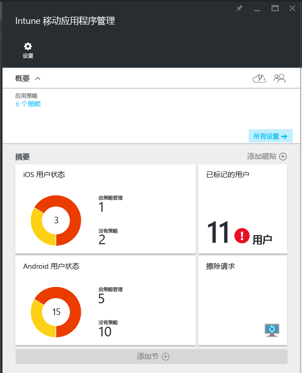

# 使用 Microsoft Intune 监视移动应用管理策略
将移动应用管理 (MAM) 策略应用到用户后，可在 [Azure 门户](https://portal.azure.com)的 Intune 应用保护边栏选项卡中监视策略的合规性状态。 可找到的信息包括受 MAM 策略影响的用户、它的合规性状态和用户可能遭遇的任何问题。

可在 3 个不同的位置监视合规性状态：

-   摘要视图

-   详细视图

-   报表视图

## 摘要视图

请按下面 3 个步骤打开“摘要”视图：

1. 转到 [Azure 门户](https://portal.azure.com)，然后输入你的凭据。
2. 选择“更多服务”，然后键入“Intune”。
3. 选择“Intune 应用保护”。

在“Intune 移动应用程序管理”边栏选项卡上，可查看合规性状态的摘要：

-   **用户**：公司中正在使用与该策略相关联的应用的用户总数。

-   **由策略管理**：在工作环境中至少使用过其中一种应用的用户数量。

-   **无策略**：正在使用与该策略相关联的应用，但却不是策略的目标用户的数量。 可以考虑将这些用户添加到策略。

- **已标记用户**：遇到问题的用户数量。 目前仅将具有已越狱设备的用户报告在“已标记用户”下。

## 详细视图
可以通过选择“用户状态”磁贴（基于设备操作系统平台）和“已标记用户”磁贴转到摘要的详细视图。

### 用户状态
可搜索单个用户并查看该用户的合规性状态。 “应用报告”边栏选项卡显示已选择用户的以下信息：
- 与用户帐户关联的设备

- 设备上具有 MAM 策略的应用

- 状态:

  - **已签入**：策略已部署到用户，且应用在工作环境中至少使用了一次。

  - **未签入**：策略已部署到用户，但应用从那时起尚未在工作环境中使用。

>[!NOTE]
> 如果搜索的用户没有部署 MAM 策略，你将看到一条消息，告知你用户不是任何 MAM 策略的目标对象。

若要查看用户的报告，请按照这些步骤进行操作：

1.  若要选择用户，请选择“摘要”磁贴。

    

2. 在打开的“应用报表”边栏选项卡上，选择“选择用户”以搜索 Azure Active Directory 用户。

    

3. 从列表中选择一个用户。 可以看到该用户合规性状态的详细信息。

### 已标记用户
详细视图显示错误消息、错误发生时访问的应用、受影响的设备操作系统平台和时间戳。

## 报表视图

可从详细视图中找到相同报表，还可通过其他报表了解 MAM 策略的合规性状态：

-   **应用保护用户报表：**概述了可在以上详细视图部分下的“用户状态”中找到的相同信息。

-   **应用保护应用报表：**提供了生成报表前，管理员可选择的两种不同应用保护状态。 状态可以为受保护，也可以为不受保护。

    

    -   托管 MAM 活动的用户状态（受保护）：此报表概述了 每个用的每个托管 MAM 应用的活动。

        -   它显示了每个用户的 MAM 策略所面向的所有应用，并通过 MAM 策略将每个应用的状态细分为“已签入”，或者显示以 MAM 策略为目标但应用从未签入的应用。
  
    -   非托管 MAM 活动的用户状态（不受保护）：此报表概述了每个用户目前已启用 MAM 的非托管应用的活动。 发生这种情况的原因如下：

        -   用户正在使用这些应用，或者这些应用是 MAM 策略目前未针对的应用。

        -   已签入所有应用，但应用还未获取任何 MAM 策略。

## 另请参阅
[管理 iOS 应用之间的数据传输](manage-data-transfer-between-ios-apps-with-microsoft-intune.md)

* [Android 应用由 MAM 策略托管时会出现的情况](user-experience-for-mam-enabled-android-apps-with-microsoft-intune.md)
* [iOS 应用由 MAM 策略托管时会出现的情况](user-experience-for-mam-enabled-ios-apps-with-microsoft-intune.md)

<!--HONumber=Jan17_HO3-->

