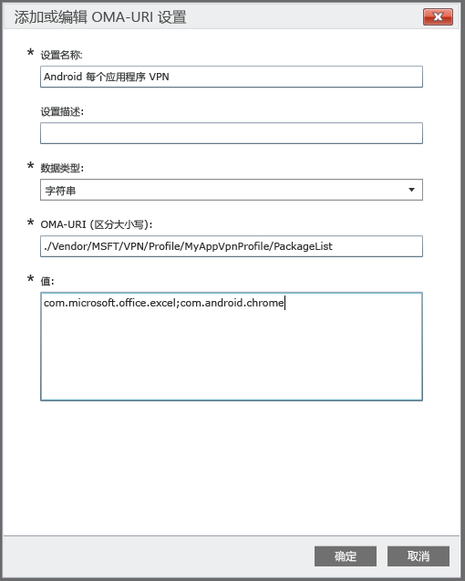

# 使用自定义策略创建适用于 Android 设备的 per-app VPN 配置文件

[!INCLUDE[classic-portal](../includes/classic-portal.md)]

可为由 Intune 管理的 Android 5.0 及更高版本设备创建每应用 VPN 配置文件。 首先，创建使用 Pulse Secure 或 Citrix 连接类型的 VPN 配置文件。 然后，创建将 VPN 配置文件与特定应用关联的自定义配置策略。 

将策略部署到 Android 设备或用户组后，用户应启动 Pulse Secure 或 Citrix VPN。 然后，该连接会仅允许来自指定应用的通信使用打开的 VPN 连接。

> [!NOTE]
>
> 此配置文件仅支持 Pulse Secure 连接类型。

### 步骤 1：创建 VPN 配置文件

1. 在 [Microsoft Intune 管理控制台](https://manage.microsoft.com)中，选择“**策略**” > “**添加策略**”。
2. 若要为新策略选择模板，展开“Android”，然后选择“VPN 配置文件（Android 4 及更高版本）”。
3. 在模板中，对于“连接类型”，请选择“Pulse Secure”或“Citrix”。
4. 完成并保存 VPN 配置文件。 有关 VPN 配置文件的更多详细信息，请参阅 [VPN 连接](../deploy-use/vpn-connections-in-microsoft-intune.md)。

> [!NOTE]
>
> 记下 VPN 配置文件名称，以便在下一步中使用。 例如，MyAppVpnProfile。

### 步骤 2：创建自定义配置策略

   1. 在 Intune 管理控制台中，选择“策略” > “添加策略” > “Android” > “自定义配置” > “创建策略”。
   2. 输入策略的名称。
   3. 在“OMA-URI 设置”下，选择“添加”。
   4. 输入设置名称。
   5. 为“数据类型”，指定“字符串”。
   6. 为**OMA-URI**指定以下字符串：**./Vendor/MSFT/VPN/Profile/*Name*/PackageList**，其中*Name*是步骤 1 中记下的 VPN 配置文件名称。 本示例中，字符串为 **./Vendor/MSFT/VPN/Profile/MyAppVpnProfile/PackageList**。
   7.   对于**值**与配置文件相关联的包列表，其中此列表以分号进行分隔。 例如，如果你希望 Excel 和 Google Chrome 浏览器使用 VPN 连接，输入 **com.microsoft.office.excel;com.android.chrome**。

#### 将应用列表设置为方块列表或允许列表（可选）
  通过使用**方块列表**值，可指定列表中的应用将*不能*使用 VPN 连接。 所有其他应用将通过 VPN 连接。
或者，你可使用 **WHITELIST** 值来指定*可以*使用 VPN 连接的应用列表。 不在列表中的应用将不会通过 VPN 连接。
  1.    在“OMA-URI 设置”下，选择“添加”。
  2.    输入设置名称。
  3.    为“数据类型”，指定“字符串”。
  4.    对于 **OMA-URI**，使用以下字符串：**./Vendor/MSFT/VPN/Profile/*Name*/Mode**，其中 *Name* 是步骤 1 中记下的 VPN 配置文件名称。 本示例中，字符串为**./Vendor/MSFT/VPN/Profile/MyAppVpnProfile/Mode**。
  5.    对于**值**，输入 **BLACKLIST** 或 **WHITELIST**。

### 步骤 3：部署两个策略

必须向*相同*Intune 组部署*这两个*策略。

1.  在“**策略**”工作区中，选择想要部署的策略，然后选择“**管理部署**”。
2.  在“管理部署”  对话框中：
    -   **若要部署策略**，选择要部署策略的一个组或多个组，然后选择“添加” > “确定”。
    -   **若要关闭对话框而不部署策略**，选择“取消”。

“策略”  工作区“概述”  页的状态摘要和警报可识别需要关注的策略问题。 状态摘要也出现在“仪表板”工作区中。

<!--HONumber=Dec16_HO2-->

