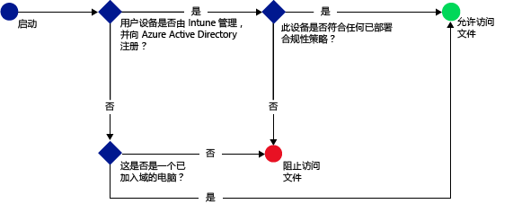

# 使用 Microsoft Intune 保护对 SharePoint Online 的访问

[!INCLUDE[classic-portal](../includes/classic-portal.md)]

使用 [!INCLUDE[wit_firstref](../includes/wit_firstref_md.md)] 条件性访问控制对位于 SharePoint Online 上的文件的访问。
条件性访问有两个组件：
- 设备合规性策略，设备必须符合才能被视为合规。
- 条件性访问策略，可指定设备必须满足才能访问服务的条件。
若要深入了解条件访问的工作原理，请参阅主题[保护对电子邮件、O365 服务和其他服务的访问](restrict-access-to-email-and-o365-services-with-microsoft-intune.md)。

将合规性和条件性访问策略部署到用户。 检查用户用于访问服务的设备是否符合策略。

如果用户尝试在其设备上使用受支持的应用（如 OneDrive）连接到文件，将进行以下评估：

在配置 SharePoint Online 的条件性访问策略**之前**，必须：
- 具有 **SharePoint Online 订阅**，并且用户必须获得 SharePoint Online 许可。
- 具有**企业移动性 + 安全性 (EMS) 订阅**或 **Azure Active Directory (Azure AD) Premium 订阅**，并且用户必须获得 EMS 或 Azure AD 许可。 有关详细信息，请参阅[企业移动性定价页](https://www.microsoft.com/en-us/cloud-platform/enterprise-mobility-pricing)或 [Azure Active Directory 定价页](https://azure.microsoft.com/en-us/pricing/details/active-directory/)。

  若要连接到所需文件，设备必须：
-   已向 [!INCLUDE[wit_nextref](../includes/wit_nextref_md.md)] **注册**或是已加入域的电脑。

-   在 Azure Active Directory 中进行**注册**（向 [!INCLUDE[wit_nextref](../includes/wit_nextref_md.md)] 注册时会自动发生此情况）。

-   **符合**任何已部署的 [!INCLUDE[wit_nextref](../includes/wit_nextref_md.md)] 合规性策略。

根据指定的条件，设备状态存储在可授予或阻止对文件的访问权限的 Azure Active Directory 中。

如果不满足条件，用户在登录时将看到以下消息之一：

-   如果未向 [!INCLUDE[wit_nextref](../includes/wit_nextref_md.md)] 注册设备，或未在 Azure Active Directory 中注册，则会显示一条消息，其中包含有关如何安装公司门户应用和进行注册的说明。

-   如果设备不合规，则会显示一条消息，将用户定向到 [!INCLUDE[wit_nextref](../includes/wit_nextref_md.md)] 公司门户网站，用户可从中找到有关问题及其修正方法的信息。

**条件访问不会应用于外部共享**。 若要了解如何在租户或站点集合中阻止外部共享，请参阅[管理您的 SharePoint Online 环境的外部共享](https://support.office.com/en-us/article/Manage-external-sharing-for-your-SharePoint-Online-environment-C8A462EB-0723-4B0B-8D0A-70FEAFE4BE85?ui=en-US&rs=en-US&ad=US)。

>[!NOTE]
>如果启用 SharePoint Online 的条件访问，建议你禁用列表上的域，如 [Remove-SPOTenantSyncClientRestriction](https://technet.microsoft.com/en-us/library/dn917451.aspx) 主题中所述。  

## 对移动设备的支持
支持以下设备：
- iOS 8.0 及更高版本
- Android 4.0 及更高版本、Samsung Knox 标准版 4.0 或更高版本
- Windows Phone 8.1 及更高版本

通过 **iOS** 和 ** Android** 设备上的浏览器进行访问时，可保护对 SharePoint Online 的访问。 仅允许从合规设备上受支持的浏览器进行访问：
* Safari (iOS)
* Chrome (Android)
* Intune Managed Browser（iOS 和 Android 5.0 及更高版本）

**将阻止不受支持的浏览器**。

## 对 PC 的支持
支持以下设备：
- Windows 8.1 及更高版本（若电脑已注册到 Intune）
- Windows 7.0、Windows 8.1 或 Windows 10（若电脑已加入域），
> [!NOTE]
>若要使用 Windows 10 电脑的条件访问，必须使用 Windows 10 周年更新更新电脑。

  - 必须将已加入域的电脑设置为[自动注册](https://azure.microsoft.com/en-us/documentation/articles/active-directory-conditional-access-automatic-device-registration/)到 Azure Active Directory。 Azure AD 设备注册服务将对 Intune 和 Office 365 客户自动激活。 已经部署了 ADFS 设备注册服务的用户不会在本地 Active Directory 上看到已注册的设备。

  - 如果策略设置为要求加入域，而电脑未加入域，则会显示一条消息，要求与 IT 管理员联系。

  - 如果策略设置要求加入域或合规，而电脑不符合任一要求，则会显示一条消息，其中包含有关如何安装公司门户应用和进行注册的说明。
  >[!NOTE]
  >运行 Intune 计算机客户端的电脑不支持条件访问。

[Office 365 新式验证必须已启用](https://support.office.com/en-US/article/Using-Office-365-modern-authentication-with-Office-clients-776c0036-66fd-41cb-8928-5495c0f9168a)，并且具有所有最新的 Office 更新。

新式验证将基于 Active Directory 身份验证库 (ADAL) 的登录引入到 Office 2013 Windows 客户端中，并实现诸如“多重身份验证”和“基于证书的身份验证”等更佳的安全性。

## 配置 SharePoint Online 的条件性访问

### 步骤 1：配置 Active Directory 安全组
在开始之前，针对条件访问策略配置 Azure Active Directory 安全组。 可在“Office 365 管理中心”，或“Intune 帐户门户”中配置这些组。 这些组将用于以用户为目标或从策略中免除用户。 如果将某个用户设定为策略目标，则其使用的每个设备都必须合规才能访问资源。

你可以在 SharePoint Online 策略中指定两种组类型：

-   **目标组**：包含将应用策略的用户组。

-   **免除组**：包含从策略中免除的用户组。

如果用户位于两个组中，则会将其从策略中免除。

### 步骤 2：配置和部署合规性策略
如果尚未执行此操作，请先创建合规性策略并将其部署到 SharePoint Online 策略将视为目标的用户。

> [!NOTE]
> 将合规性策略部署到 [!INCLUDE[wit_nextref](../includes/wit_nextref_md.md)] 组，而条件性访问策略以 Azure Active Directory 安全组为目标。

若要深入了解如何配置合规性策略，请参阅[创建合规性策略](create-a-device-compliance-policy-in-microsoft-intune.md)。

> [!IMPORTANT]
> 如果尚未部署合规性策略，那么设备将被视为合规。

准备就绪后，继续执行**步骤 3**。

### 步骤 3：配置 SharePoint Online 策略
接下来，配置策略以要求只有托管及合规设备才能访问 SharePoint Online。 此策略存储在 Azure Active Directory 中。

#### 

>[!NOTE]
> 还可在 Azure AD 管理控制台中为 Intune 设备创建条件访问策略，该策略在 Azure AD 中称为“基于设备的条件访问策略”。 此外，可创建其他条件访问策略，如多重身份验证。 还可为 Azure AD 支持的第三方企业应用（如 Salesforce 和 Box）设置条件访问策略。 有关详细信息，请参阅[如何将 Azure Active Directory 针对访问控制的基于设备的条件访问策略设置为 Azure Active Directory 连接的应用程序](https://azure.microsoft.com/en-us/documentation/articles/active-directory-conditional-access-policy-connected-applications/)。

1.  在 [Microsoft Intune 管理控制台](https://manage.microsoft.com)中，选择“策略” > “条件访问” > “SharePoint Online 策略”。

2.  选择“启用 SharePoint Online 的条件性访问策略”。

3.  在“应用程序访问”下，可以选择将条件性访问策略应用到：

    -   **所有平台**

        这要求用于访问 **SharePoint Online** 的设备已在 Intune 中注册且符合相应的策略。 任何使用**新式验证**的客户端应用程序需遵守条件性访问策略。 如果 Intune 当前不支持该平台，则会阻止对 **SharePoint Online** 的访问。

        选择“所有平台”选项意味着无论客户端应用程序报告的是什么平台，Azure Active Directory 都会将此策略应用于所有身份验证请求。 所有平台都需为已注册并合规，以下各项除外：
        *    Windows 设备需要注册并合规，并且/或者域已加入本地 Active Directory 域。
        * 不受支持的平台，如 Mac。 但是，仍将阻止使用来自这些平台的新式验证的应用。

    -   **特定平台**

         条件性访问策略会应用到在你指定的平台上使用新式验证的任何客户端应用。

     对于 Windows 电脑，电脑必须已加入域，或是已向 [!INCLUDE[wit_nextref](../includes/wit_nextref_md.md)] 注册并且合规。 可以设置以下要求：

     -   **设备必须已加入域或必须是合规的。** 选择此选项要求电脑必须已加入域或符合在 [!INCLUDE[wit_nextref](../includes/wit_nextref_md.md)] 中设置的策略。 如果电脑不满足任一要求，则系统会提示用户向 [!INCLUDE[wit_nextref](../includes/wit_nextref_md.md)] 注册设备。

     -   **设备必须是合规的。** 选择此选项要求电脑必须在 [!INCLUDE[wit_nextref](../includes/wit_nextref_md.md)] 中注册并且必须合规。 如果电脑未注册，则会显示一条消息，其中包含有关如何注册的说明。

4.   在**浏览器访问** SharePoint Online 和 OneDrive for Business 下，可选择仅允许通过受支持的浏览器（Safari (iOS) 和 Chrome (Android)）访问 Exchange Online。 将阻止来自其他浏览器的访问。 为 OneDrive 的应用程序访问选择的相同平台限制在此处同样适用。

  在 **Android** 设备上，用户必须启用浏览器访问。 若要执行此操作，用户必须在已注册的设备上选择“启用浏览器访问”选项，如下所示：
  1.    打开“公司门户”应用。
  2.    通过省略号 (…) 或硬件菜单按钮，转到“设置”页面。
  3.    按“启用浏览器访问”按钮。
  4.    在 Chrome 浏览器中，从 Office 365 中注销并重启 Chrome。

  在 **iOS** 和 **Android** 平台上，为了识别用于访问服务的设备，Azure Active Directory 将向设备颁发一个传输层安全性 (TLS) 证书。 设备会显示证书，并提示用户选择证书，如下面的屏幕截图所示。 用户必须选择此证书，然后才能使用浏览器。

  **iOS**

  

  **Android**

  
5.  在“目标组”下，选择“修改”选择将应用策略的 Azure Active Directory 安全组。 你可以选择将此应用于所有用户或仅针对选择的用户组。

6.  或者，在“免除组”下，选择“修改”以选择从此策略中免除的 Azure Active Directory 安全组。

7.  完成后，选择“保存”。

不需要部署条件访问策略—它会立即生效。

### 步骤 4：监视合规性和条件访问策略
在“组”工作区中，可以查看设备的状态。

选择任一移动设备组。 然后在“设备” 选项卡上，选择以下“筛选器”之一：

-   **未向 AAD 注册的设备**。 阻止这些设备访问 SharePoint Online。

-   **不合规的设备**。 阻止这些设备访问 SharePoint Online。

-   **已向 AAD 注册并合规的设备**。 这些设备可访问 SharePoint Online。

### 另请参阅
[使用 Microsoft Intune 保护对电子邮件和 O365 服务的访问](restrict-access-to-email-and-o365-services-with-microsoft-intune.md)

<!--HONumber=Feb17_HO3-->

