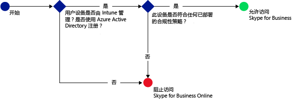
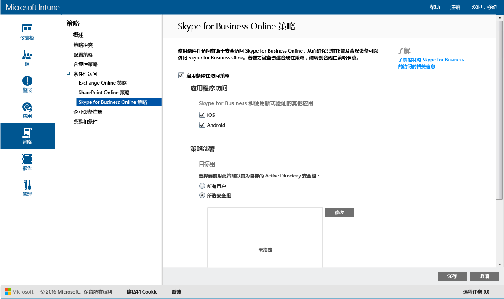

# 使用 Microsoft Intune 保护对 Skype for Business Online 的访问

[!INCLUDE[classic-portal](../includes/classic-portal.md)]

可使用 **Skype for Business Online** 的条件性访问策略控制对 Skype for Business Online 的访问。
条件性访问有两个组件：
- 设备合规性策略，设备必须符合才能被视为合规。
- 条件性访问策略，可指定设备必须满足才能访问服务的条件。
若要了解有关条件性访问如何工作的详细信息，请阅读文章[保护对电子邮件和 O365 服务的访问](restrict-access-to-email-and-o365-services-with-microsoft-intune.md)。

当目标用户尝试在其设备上使用 Skype for Business Online 时，会进行以下评估：

在配置 Skype for Business Online 的条件性访问策略**之前**，必须：
- 具有 **Skype for Business Online 订阅** 并将 Skype for Business Online 许可证分配给用户。
- 具有**企业移动性 + 安全性 (EMS) 订阅**或 **Azure Active Directory (Azure AD) Premium 订阅**，并让用户获得 EMS 或 Azure AD 许可。 有关详细信息，请参阅[企业移动性定价](https://www.microsoft.com/cloud-platform/enterprise-mobility-pricing)或 [Azure Active Directory 定价](https://azure.microsoft.com/pricing/details/active-directory/)。

-   为 Skype for Business Online[启用“新式验证”](https://docs.microsoft.com/intune/deploy-use/restrict-access-to-skype-for-business-online-with-microsoft-intune)。
-  让所有用户使用 **Skype for Business Online**。 如果本地具有同时使用 Skype for Business Online 和 Skype for Business 进行的部署，那么条件性访问策略将不会应用到用户。

需要访问 Skype for Business Online 的设备必须：

-   是 **Android** 或 **iOS** 设备。

-   已向 Intune **注册**。

-   **符合**任何已部署的 Intune 符合性策略。

基于指定的条件，设备状态存储在可授予或阻止访问权限的 Azure Active Directory 中。

如果不满足条件，用户在登录时将看到以下其中消息之一：

-   如果设备未向 Intune 注册，或未在 Azure Active Directory 中注册，则会显示一条消息，说明如何安装公司门户应用并进行注册。

-   如果设备不符合策略，则显示一条消息，将用户定向到 Intune 公司门户网站或公司门户应用，用户可从中找到相关问题及其修复方法的信息。

## 配置 Skype for Business Online 的条件性访问

### 步骤 1：配置 Azure Active Directory 安全组
在开始之前，针对条件访问策略配置 Azure Active Directory 安全组。 你可以在“Office 365 管理中心”中配置这些组。 这些组将用于以用户为目标或从策略中免除用户。 如果将某个用户设定为策略的目标，则其使用的每个设备必须合规才能访问资源。

你可以指定两种用于 Skype for Business 策略的组类型：

-   **目标组**：包含将应用策略的用户组。

-   **免除组**：包含从策略中免除的用户组。

如果用户位于两个组中，则会将其从策略中免除。

### 步骤 2：配置和部署合规性策略
[创建](create-a-device-compliance-policy-in-microsoft-intune.md)合规性策略并将其[部署](deploy-and-monitor-a-device-compliance-policy-in-microsoft-intune.md)到将受此策略影响的所有设备。 这些将是“目标组”中的用户所使用的所有设备。

> [!NOTE]
> 将合规性策略部署到 Intune 组，而条件性访问策略以 Azure Active Directory 安全组为目标。

> [!IMPORTANT]
> 如果尚未部署合规性策略，那么设备将被视为合规。

准备就绪后，继续执行**步骤 3**。

### 步骤 3：配置 Skype for Business Online 策略
接下来，配置策略以要求只有托管及合规的设备才能访问 Skype for Business Online。 此策略将存储在 Azure Active Directory 中。

1.  在 [Microsoft Intune 管理控制台](https://manage.microsoft.com)中，选择“策略” > “条件性访问” > “Skype for Business Online 策略”。

  

2.  选择“启用条件访问策略”。

3.  在“应用程序访问”下，可以选择将条件性访问策略应用到：

    -   **iOS**

    -   **Android**

4.  在“目标组”下，选择“修改”以选择将应用策略的 Azure Active Directory 安全组。 你可以选择将此应用于所有用户或仅针对选择的用户组。

5.  或者，在“免除组”下，选择“修改”以选择从此策略中免除的 Azure Active Directory 安全组。

6.  完成后，选择“保存”。

现在你已配置了 Skype for Business Online 的条件性访问。 不需要部署条件访问策略—它会立即生效。

## 监视遵从性和条件性访问策略
在“组”  工作区中，可以查看设备的条件访问状态。

选择任一移动设备组。 然后在“设备” 选项卡上，选择以下“筛选器”之一：

* **未向 AAD 注册的设备**：阻止这些设备访问 Skype for Business Online。

* **不合规的设备**：阻止这些设备访问 Skype for Business Online。

* **已向 AAD 注册并合规的设备**：这些设备可以访问 Skype for Business Online。

