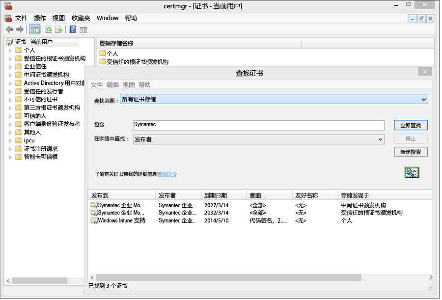
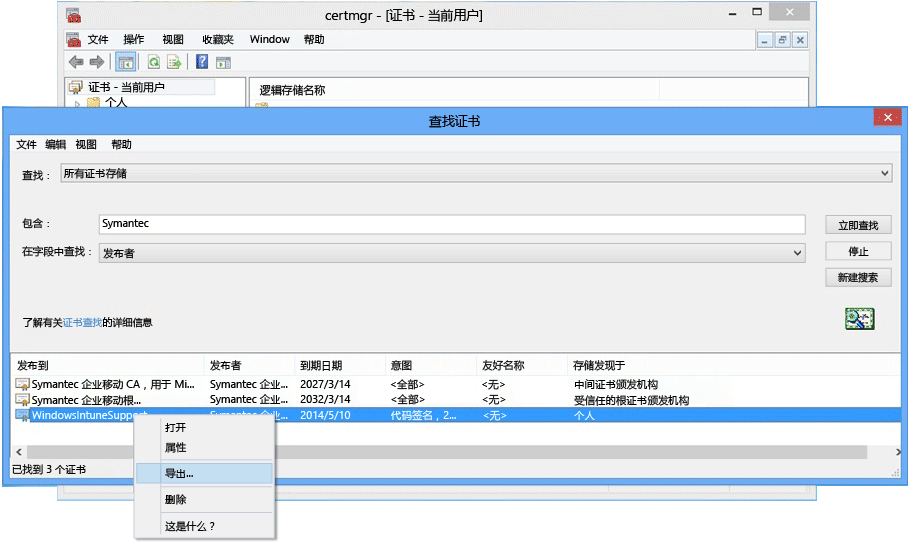

# <a name="sign-line-of-business-apps-so-they-can-be-deployed-to-windows-devices-with-intune"></a>对业务线应用进行签名，以便可以将其部署到具有 Intune 的 Windows 设备

[!INCLUDE[classic-portal](../includes/classic-portal.md)]

作为 Intune 管理员，可以将业务线 (LOB) 应用部署到 Windows 和 Windows 10 移动版设备，包括公司门户应用。 若要将 .appx 或 .xap 应用部署到 Windows 10 和 Windows 10 移动版设备，或将任何 LOB 应用部署到 Windows 8.1 或 Windows Phone 8.1 设备，必须获取 **Symantec 企业移动代码签名证书**。 对于各类 Windows 设备的这些应用，仅有 Symantec 证书才受信任。 可以对 Windows 10 应用和“通用”应用使用自己的证书颁发机构。 此证书用于：

-   对公司门户应用进行签名以部署到 Windows 电脑、Windows 10 移动版设备和 Windows Phone 设备

-   对公司业务线应用进行签名，以便 Intune 可以将其部署到 Windows 设备

下列步骤将帮助你获取所需的证书并对应用进行签名。 你将需要 Windows Phone 开发人员中心帐户，然后需要购买 Symantec 证书。


1. **加入 Windows Phone 开发人员中心**<br>
   登录时使用公司帐户信息加入 [Windows Phone 开发人员中心](http://go.microsoft.com/fwlink/?LinkId=268442) ，以购买你的公司帐户。 在你接收代码签名证书之前，此请求需获得公司主管授权。

2. **获取公司 Symantec 证书**<br>
  使用你的 Symantec ID 从 [Symantec 网站](http://go.microsoft.com/fwlink/?LinkId=268441) 购买证书。 购买证书后，在你 Windows Phone 开发人员帐户中指定的公司审批人将收到一封请求审批证书请求的电子邮件。 有关 Symantec 证书要求的详细信息，请参阅[为什么 Windows Phone 需要 Symantec 证书？](https://technet.microsoft.com/en-us/library/dn764959.aspx#BKMK_Symantec) Windows 设备注册常见问题。

3.  **导入证书**<br>
    批准请求后，你将收到一封包含导入证书说明的电子邮件。 按照电子邮件中的说明导入证书。

4.  **验证导入的证书**<br>
    要验证是否正确导入了证书，请转到“证书”管理单元，右键单击“证书”，并选择“查找证书”。 在 **“包含”** 字段中输入“Symantec”，然后单击 **“立即查找”**。 导入的证书应出现在结果中。

    

5. **导出签名证书**<br>
    验证证书是否存在后，可以导出 .pfx 文件以进行公司门户签名。 选择“预期目的”为“代码签名”的 Symantec 证书。 右键单击代码签名证书并选择**导出**。

    

    在 **“证书导出向导”**中，选择 **“是，导出私钥”** ，然后单击 **“下一步”**。 **选择“个人信息交换 - PKCS #12 (.PFX)”**，并选择**如果可能，在证书路径中包括所有证书**。 完成向导。 有关详细信息，请参阅 [How to Export a Certificate with the Private Key（如何导出带私钥的证书）](http://go.microsoft.com/fwlink/?LinkID=203031)。

6.  **将应用上传到 Intune**<br>
    上传已签名应用文件和你的代码签名证书，以便最终用户可以使用此应用。

    1.  在 [Intune 管理控制台中](http://manage.microsoft.com)，单击**管理**&gt;**Windows Phone**。

    2.  单击“上传已签名的应用文件”并用 Intune 管理员 ID 进行签名。

    3.  将导出的证书 (.pfx) 文件添加到“代码签名证书”并创建证书的密码。

    4.  完成向导。

## <a name="example-download-sign-and-deploy-the-company-portal-app-for-windows-devices"></a>示例：下载、签名和部署适用于 Windows 设备的公司门户应用

可以使用 Intune 将公司门户应用部署到 Windows 设备（包括 Windows Phone 和 Windows 10 移动版设备），而不是从 Windows 应用商店进行安装。 必须下载公司门户应用，并使用你的证书对其进行签名。  只有在你的用户不会使用公司应用商店，并且你想要将公司门户部署到 Windows Phone 8.1 设备的情况下，此操作才有必要。


1.  **下载公司门户应用**

    若要使用 Intune 部署公司门户应用，可以从下载中心下载 [Microsoft Intune Company Portal App for Windows Phone 8.1](http://go.microsoft.com/fwlink/?LinkId=615799)（适用于 Windows Phone 8.1 的 Microsoft Intune 公司门户应用）并运行自解压缩 (.exe) 文件。 此文件包含两个文件：

    -   CompanyPortal.appx – 适用于 Windows Phone 8.1 的公司门户安装

    -   WinPhoneCompanyPortal.ps1 – 可用于对公司门户应用文件进行签名，以便将文件部署到 Windows Phone 8.1 设备的 PowerShell 脚本

    或者，可以从[适用于企业的 Windows 应用商店](http://businessstore.microsoft.com/)下载 Windows Phone 8.1 公司门户（脱机许可包）或 Windows 10 公司门户（脱机许可包）。 公司门户应用需要具备脱机许可证以及为脱机使用而下载的相应的包。 选项中 Windows 8 和 Windows Phone 8 平台列表指的是各自 8.1 版本的对应项。 若要详细了解如何使用 Intune 完成此操作，请参阅[管理从适用于企业的 Windows 应用商店购买的应用](manage-apps-you-purchased-from-the-windows-store-for-business-with-microsoft-intune.md)。

2.  **下载 Windows Phone SDK** 下载 Windows Phone SDK 8.0](http://go.microsoft.com/fwlink/?LinkId=615570) 并将 SDK 安装到你的计算机。 需要此 SDK 来生成应用程序注册令牌。

3.  **生成 AETX 文件**通过使用 AETGenerator.exe（Windows Phone SDK 8.0 的一部分），从 Symantec PFX 文件生成应用程序注册令牌 (.aetx) 文件。 有关如何创建 AETX 文件的说明，请参阅 [如何为 Windows Phone 生成应用程序注册令牌](https://msdn.microsoft.com/library/windows/apps/jj735576.aspx)

4.  **下载适用于 Windows 8.1 的 Windows SDK**下载并安装 [Windows Phone SDK](http://go.microsoft.com/fwlink/?LinkId=613525) (http://go.microsoft.com/fwlink/?LinkId=613525)。 请注意，公司门户应用中包含的 PowerShell 脚本使用默认安装位置 `${env:ProgramFiles(x86)}\Windows Kits\8.1`。 如果安装到其他位置，则必须包括 cmdlet 参数中的位置。

5.  **使用 PowerShell 对应用进行代码签名**以管理员身份在主计算机上打开随 Windows SDK（Symantec 企业移动代码签名证书）一起安装的 **Windows PowerShell**，导航到 Sign-WinPhoneCompanyPortal.ps1 文件并运行该脚本。

    **示例 1**

    ```
    .\Sign-WinPhoneCompanyPortal.ps1 -InputAppx 'C:\temp\CompanyPortal.appx' -OutputAppx 'C:\temp\CompanyPortalEnterpriseSigned.appx' -PfxFilePath 'C:\signing\cert.pfx' -PfxPassword '1234' -AetxPath 'C:\signing\cert.aetx'
    ```
    此示例对 C:\temp\ 中的 CompanyPortal.appx 进行签名，并生成 CompanyPortalEnterpriseSigned.appx。 它将使用 PFX 密码 1234，并从 PFX 文件读取发布者 ID。 还将从 cert.aetx 文件读取企业 ID。

    **示例 2**

    ```
    .\Sign-WinPhoneCompanyPortal.ps1 -InputAppx 'C:\temp\CompanyPortal.appx' -OutputAppx 'C:\temp\CompanyPortalEnterpriseSigned.appx' -PfxFilePath 'C:\signing\cert.pfx' -PfxPassword '1234' -PublisherId 'OID.0.9.2342.19200300.100.1.1=1000000001, CN="Test, Inc.", OU=Test 1' -EnterpriseId 1000000001
    ```
    此示例对 C:\temp\ 中的 CompanyPortal.appx 进行签名，并生成 CompanyPortalEnterpriseSigned.appx。 它将使用 PFX 密码 1234，并使用指定的发布者 ID。

    **参数：**

    -   `-InputAppx` – CompanyPortal.appx 文件的本地路径（包含在单引号中）。 例如 'C:\temp\CompanyPortal.appx'

    -   `-OutputAppx` – 已签名公司门户应用的本地路径和文件名（包含在单引号中）。 例如 'C:\temp\CompanyPortalEnterpriseSigned.appx'

    -   `-PfxFilePath` – 已导出的 Symantec 证书的 PFX 文件的本地路径和文件名。 例如 'C:\signing\cert.pfx'

    -   `-PfxPassword` – 用于签署 PFX 文件的密码（包含在单引号中）。 例如 '1234'

    -   `-AetxPath` – 用于读取企业 ID 的 .aetx 文件的本地路径（如果未定义“EnterpriseId”参数。） 必须提供此参数或 EnterpriseId。 例如 'C:\signing\cert.aetx'

    -   `-PublisherId` - 企业的发布者 ID。 如果不存在，则使用 Symantec 企业移动代码签名证书的“使用者”字段。 例如 'OID.0.9.2342.19200300.100.1.1=1000000001, CN="Test, Inc.", OU=Test 1'

    -   `-SdkPath` - 适用于 Windows 8.1 的 Windows SDK 的根文件夹路径。 此参数是可选参数，默认值为 ${env:ProgramFiles(x86)}\Windows Kits\8.1。

    -   `-EnterpriseId` - 企业 ID。 必须提供此参数或“AetxPath”。 如果未提供此参数，则从 AETX 文件中读取企业 ID。 例如 1000000001

6.  部署 Windows Phone 8.1 公司门户 (SSP.appx) 应用。 有关指南，请参阅[在 Microsoft Intune 中部署应用](deploy-apps-in-microsoft-intune.md)。

## <a name="how-to-renew-the-symantec-enterprise-code-signing-certificate"></a>如何续订 Symantec 企业代码签名证书

用于部署 Windows 和 Windows Phone 移动应用的 Symantec 证书必须定期续订。

1.  大约在证书到期前 14 天查找发自 Symantec 的续订电子邮件。 电子邮件包括 Symantec 有关续订你的企业证书的说明。

    有关 Symantec 证书的其他信息，请访问 [www.symantec.com](http://www.symantec.com) 或致电 1-877-438-8776 或 1-650-426-3400。

2.  转到网站（例如： [https://products.websecurity.symantec.com/orders/enrollment/microsoftCert.do](https://products.websecurity.symantec.com/orders/enrollment/microsoftCert.do)），并使用 Symantec 发布者 ID 和与证书关联的电子邮件地址登录。 记住，请使用你将用于下载证书的同一计算机开始续订。

3.  续订获批并支付后，下载该证书。

### <a name="how-to-install-the-updated-certificate-for-line-of-business-lob-apps"></a>如何为业务线 (LOB) 应用安装更新的证书

1.  对业务线应用的最新版本进行签名。

2.  打开你的 [Intune 管理控制台](https://admin.manage.microsoft.com) (https://admin.manage.microsoft.com) 并转到“管理员”&gt;“移动设备管理”&gt;“Windows Phone”，然后单击“上传已签名的应用”。

3.  上载已签名的新公司门户。 你将需要新签名的 SSP.xap 文件和你从 Symantec 收到的新 .PFX 文件，或使用此新 .PFX 文件创建的应用程序注册令牌。

4.  上载完成时，在 **“软件”**  工作区中删除旧版本的公司门户。

5.  使用新证书对所有新的和任何更新的企业业务线应用签名。 现有应用程序不需要重新签名和重新部署。

## <a name="manually-deploy-windows-10-company-portal-app"></a>手动部署 Windows 10 公司门户应用
即使尚未将 Intune 与适用于企业的 Windows 应用商店集成，也可以直接从 Intune 手动部署 Windows 10 公司门户应用。

 > [!NOTE]
 > 每次发布应用更新时，此选项都需要部署手动更新。

1. 在[适用于企业的 Windows 应用商店](https://www.microsoft.com/business-store)中登录到你的账户，并获取公司门户应用的**脱机许可证**版本。  
2. 获得应用之后，选择“**清单**”页中的应用。  
3. 选择“**Windows 10 所有设备**”作为“**平台**”，然后选择相应的**体系结构**并下载。 此应用不需要应用许可证文件。

4. 下载“所需框架”下的所有包。 必须对 x86、x64 和 ARM 体系结构完成此操作，并生成如下所示的共 9 个包。  

5. 将公司门户应用上载到 Intune 之前，按以下方式创建一个包含构建的包的文件夹（例如，C:\Company Portal）：
  1. 将公司门户包放置在 C:\Company Portal 中。 并在此位置创建一个 Dependencies 子文件夹。  
  
  2. 将九个依赖项包置于 Dependencies 文件夹中。  
  如果依赖项未按此格式放置，Intune 将无法在包上载期间将其识别并上载，从而导致上载失败并出现以下错误。  
  
6. 返回到 Intune，然后将公司门户作为新的应用上载。 将其作为所需的应用部署到所需的目标用户集。  

有关 Intune 如何处理通用应用的依赖项的详细信息，请参阅[通过 Microsoft Intune MDM 部署具有依赖项的 appxbundle](https://blogs.technet.microsoft.com/configmgrdogs/2016/11/30/deploying-an-appxbundle-with-dependencies-via-microsoft-intune-mdm/)。  

### <a name="how-do-i-update-the-company-portal-on-my-users-devices-if-they-have-already-installed-the-older-apps-from-the-store"></a>如果已从应用商店安装旧版应用，那么如何更新用户设备上的公司门户？
如果你的用户已从应用商店安装 Windows 8.1 或 Windows Phone 8.1 公司门户应用，那么它们应自动更新到新版本，你或你的用户无需执行任何操作。 如果未更新，则要求用户检查他们是否在设备上启用了应用商店应用的自动更新。   

### <a name="how-do-i-upgrade-my-sideloaded-windows-81-company-portal-app-to-the-windows-10-company-portal-app"></a>如何将我的旁加载 Windows 8.1 公司门户应用升级到 Windows 10 公司门户应用？
我们推荐的迁移途径是通过将部署操作设置为“卸载”，删除 Windows 8.1 公司门户应用的部署。 完成此操作后，可以使用上面任意选项部署 Windows 10 公司门户应用。  

如果需要旁加载应用并且在未使用 Symantec 证书进行签名的情况下部署了 Windows 8.1 公司门户，则直接通过上面的 Intune 部分按照“部署”中的步骤完成升级。

如果需要旁加载应用，并且使用 Symantec 代码签名证书签名和部署了 Windows 8.1 公司门户，请按照以下部分内容的步骤操作。  

### <a name="how-do-i-upgrade-my-signed-and-sideloaded-windows-phone-81-company-portal-app-or-windows-81-company-portal-app-to-the-windows-10-company-portal-app"></a>如何将已签名和旁加载的 Windows Phone 8.1 公司门户应用或 Windows 8.1 公司门户应用升级到 Windows 10 公司门户应用？
我们推荐的迁移路径是通过将部署操作设置为“卸载”，删除 Windows Phone 8.1 公司门户应用或 Windows 8.1 公司门户应用的现有部署。 完成此操作后，Windows 10 公司门户应用便可以正常部署。  

否则，Windows 10公司门户应用需要进行相应更新和签名，以确保遵循升级过程。  

如果 Windows 10 公司门户应用已按此方式签名和部署，则需要在应用商店中可用时为每个新的应用更新重复此过程。 应用商店更新时，应用不会自动更新。  

以下是签名和部署应用的方式：

1. 从 [https://aka.ms/win10cpscript](https://aka.ms/win10cpscript) 下载 Microsoft Intune Windows 10 公司门户应用签名脚本。  此脚本需要在主计算机上安装适用于 Windows 10 的 Windows SDK。 若要下载适用于 Windows 10 的 Windows SDK，请访问 [https://go.microsoft.com/fwlink/?LinkId=619296](https://go.microsoft.com/fwlink/?LinkId=619296)。
2. 如上所述，从适用于企业的 Windows 应用商店下载 Windows 10 公司门户应用。  
3. 运行在脚本标头中详细说明了其输入参数的脚本，对 Windows 10 公司门户应用进行签名（以下进行了提取）。 不需要将依赖项传入该脚本。 只有在应用上载到 Intune 管理控制台时才需要依赖项。

|参数 | 描述|
| ------------- | ------------- |
|InputWin10AppxBundle |定位到源 appxbundle 文件所在位置的路径 |
|OutputWin10AppxBundle |已签名的 appxbundle 文件 Win81Appx 的输出路径。  定位到 Windows 8.1 或 Windows Phone 8.1 公司门户 (.APPX) 文件所在位置的路径。|
|PfxFilePath |Symantec 企业移动代码签名证书 (.PFX) 文件的路径。 |
|PfxPassword| Symantec 企业移动代码签名证书的密码。 |
|PublisherId |企业的发布者 ID。 如果不存在，则使用 Symantec 企业移动代码签名证书的“使用者”字段。|
|SdkPath | 适用于 Windows 10 的 Windows SDK 的根文件夹路径。 此参数为可选，默认为 ${env:ProgramFiles(x86)}\Windows Kits\10|
在运行结束时，该脚本将输出签名版本的 Windows 10 公司门户应用。 然后可以通过 Intune 将签名版应用部署为 LOB 应用，后者会将当前部署的版本升级到此新的应用。  

