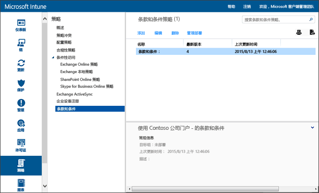

# Microsoft Intune 中的条款和条件策略设置

[!INCLUDE[classic-portal](../includes/classic-portal.md)]

可以将 Intune 条款和条件部署到用户组，以解释注册、访问工作资源和使用公司门户对设备和用户有何影响。 用户必须接受这些条款和条件，然后才能使用公司门户进行注册或访问工作。

你可以创建和部署包含不同条款和条件的多个策略。 也可以用不同的语言生成相同条款和条件的不同版本，然后将它们部署到相应的组。

## 创建条款和条件策略

1.  在 [Microsoft Intune 管理控制台](http://manage.microsoft.com)中，单击“策略”&gt;“条款和条件”。

    

2.  单击“添加”以创建新的条款和条件策略。

    也可以“编辑”或“删除”现有策略。

3.  在“创建条款和条件”页上，指定以下信息：

    -   “名称”&mdash; 显示在 Intune 控制台中的唯一策略名称。

    -   “说明”&mdash; 可帮助识别 Intune 控制台中的策略的详细信息。

    -   **标题**&mdash;用户在公司门户中看到的标题。

    -   “用于解释用户接受的含义的文本”&mdash; 用户看到的关于接受的标签。 例如：“我同意条款和条件。”

4.  完成后，单击“保存”。 新策略将显示在“策略”工作区的“条款和条件”节点中。

## 部署条款和条件策略

1.  在 [Microsoft Intune 管理控制台](http://manage.microsoft.com)中，单击“策略”&gt;“条款和条件”。

2.  在“条款和条件策略”列表中，选择要部署的策略，然后单击“管理部署”。

3.  在“管理部署”对话框中，选中要对其部署策略的用户组，然后单击“确定”。

    当目标用户访问公司门户时，Intune 将显示部署的条款和条件。 用户必须接受这些条款，然后才能访问公司资源。

## 监视条款和条件策略

1.  在 [Microsoft Intune 管理控制台](http://manage.microsoft.com)中，单击“策略”&gt;“条款和条件”。

2.  在“创建新报告”窗口中，单击“查看报告”。 此时将打开详细说明用户接受了你部署的哪些条款和条件的报告。

### 条款和条件的更新和版本控制
编辑现有条款和条件策略时，可以选择在部署策略时执行该行为。 使用以下过程帮助你更新现有的条款和条件策略。

## 使用多个版本的条款和条件

1.  在 [Microsoft Intune 管理控制台](http://manage.microsoft.com)中，单击“策略”&gt;“条款和条件”。

2.  选择要编辑的条款和条件策略，然后单击“编辑”。

3.  在“编辑条款和条件”页上，进行任何所需的编辑，然后指定该新版本是否要求所有用户都接受条款和条件，还是仅新用户能看到新版本。

    建议增加版本号，并在条款和条件策略发生重大变更时要求用户接受。 如果修改错别字或更改格式设置，则维持当前版本号。

### 另请参阅
[使用 Microsoft Intune 策略管理设备上的设置和功能](manage-settings-and-features-on-your-devices-with-microsoft-intune-policies.md)

<!--HONumber=Dec16_HO2-->

