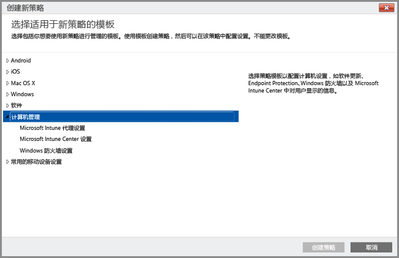

# 使用策略简化 Windows 电脑管理

若要通过在 Windows 桌面上运行 Intune 软件客户端将桌面作为电脑管理，可只在 Intune 管理控制台中使用“计算机管理”下的策略。 管理控制台中列出所有其他策略都仅适用于移动设备。 使用**计算机管理**策略，可在 Microsoft Intune Center 中配置设置、控制对电脑的更新，以及为电脑配置 Windows 防火墙。

### 管理 Microsoft Intune Center
用户可以看到 Intune 软件客户端作为 **Microsoft Intune 中心**。 Microsoft Intune Center 使用户能够：

-   从公司门户中获取应用程序。

-   检查更新。

-   管理 Microsoft Intune Endpoint Protection。

-  请求远程协助。

Microsoft Intune Center 安装在所有被管理的计算机上。 可以在 Intune 策略中配置下列设置，并且这些设置将在 Microsoft Intune Center 中向用户显示：

|策略设置|详细信息|
|------------------|--------------------|
|**Name**|负责管理计算机的管理员的名称。 最大长度：40 个字符|
|**电话号码**|负责管理计算机的管理员的电话号码。 最大长度：20 个字符|
|**电子邮件地址**|负责管理计算机的管理员的电子邮件地址。 最大长度：40 个字符|
|**网站名称**|用户的支持网站的名称。 >最大长度：40 个字符|
|**网站 URL**|支持网站的 URL。 最大长度：150 个字符|
|**注意**|向用户显示的注释。 最大长度：120 个字符|

有关可对 Windows 电脑配置的策略和设置的相关信息，请参阅以下资源：

- [在 Microsoft Intune 中利用软件更新使 Windows 电脑保持最新状态](keep-windows-pcs-up-to-date-with-software-updates-in-microsoft-intune.md) - 这些策略使托管计算机检查软件更新，并从 Microsoft 和第三方下载软件更新。 这些更新不包括操作系统更新（例如，从 Windows 7 升级到 Windows 10，或从一个 Windows 10 版本升级到更高版本）。

- [使用适用于 Microsoft Intune 的 Endpoint Protection 帮助保障 Windows 电脑的安全](help-secure-windows-pcs-with-endpoint-protection-for-microsoft-intune.md) - 这些设置包括检测到恶意软件时要实施的扫描计划和操作。

- [在 Microsoft Intune 中使用 Windows 防火墙策略帮助保护 Windows 电脑](help-protect-windows-pcs-using-windows-firewall-policies-in-microsoft-intune.md) - 这些策略可简化托管计算机上 Windows 防火墙设置的管理。

### 另请参阅

[使用 Intune 软件客户端的常见 Windows 电脑管理任务](common-windows-pc-management-tasks-with-the-microsoft-intune-computer-client.md)

<!--HONumber=Dec16_HO3-->

