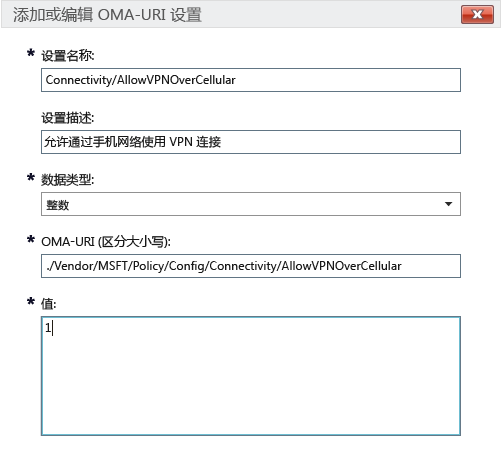

# Microsoft Intune 中适用于 Windows 10 设备的 Intune 策略设置

本主题包含的信息可帮助你了解可用于管理 Windows 10 设备的 Intune 策略设置。 请阅读本主题以及[使用 Microsoft Intune 策略管理设备上的设置和功能](manage-settings-and-features-on-your-devices-with-microsoft-intune-policies.md)中的步骤，为已注册的 Windows 10 桌面版和 Windows 10 移动版设备配置内置和自定义设置。 无法将这些策略用于运行“[Intune PC 客户端软件](/intune/get-started/windows-pc-management-capabilities-in-microsoft-intune)”的电脑。

可以从两种策略类型中进行选择：

- **自定义策略**：使用适用于 Windows 10 和 Windows 10 移动版的 Microsoft Intune **自定义策略**来部署可用于控制设备上功能的 OMA-URI（开放移动联盟统一资源标识符）设置。 Windows 10 通过“[策略配置服务提供程序(策略 CSP)](https://technet.microsoft.com/itpro/windows/manage/how-it-pros-can-use-configuration-service-providers)”提供许多设置。
- **常规配置策略**：如果想要从 Microsoft Intune 提供的内置列表中选择设置，则使用此策略类型。

## 自定义策略设置

在自定义策略中提供以下设置。

### 常规

输入名称和有助于在 Intune 控制台中识别该策略的描述（后者为可选）。

### OMA-URI 设置

对于想要添加的每个 OMA URI 设置，请输入以下信息。 使用本主题中的 [Windows 10 URI 设置参考](/intune/deploy-use/windows-10-policy-settings-in-microsoft-intune#Windows-10-URI-settings)了解可以使用的设置：

- **设置名称**：输入 OMA-URI 设置的唯一名称，以帮助你在设置列表中识别它。
- **设置描述** -（可选）输入设置的描述。
- **数据类型**：从以下数据类型中进行选择：
    - **字符串**
    - **字符串 (XML)**
    - **日期和时间**
    - **整数**
    - **浮点**
    - **布尔值**
- **OMA-URI（区分大小写）**：指定想要为其提供设置的 OMA-URI。
- **值**：指定要与输入的 OMA-URI 关联的值。

### 示例
在以下屏幕截图中，已启用设置 **Connectivity/AllowVPNOverCellular**。 这样一来，Windows 10 设备在处于移动电话网络中时会打开 VPN 连接。

> 

## Windows 10 URI 设置
使用此部分来了解你可以对 **Windows 10 自定义策略**配置的 OMA-URI 设置。

### 策略

|策略名称和 URI|详细信息|
|---------------|------------|-----------|
|**允许自动更新** ./Vendor/MSFT/Policy/Config/Update/AllowAutoUpdate|仅限桌面版 **数据类型：** 整数 **值：** **0** - **5**（默认值：**1**）|
|**计划安装日期** ./Vendor/MSFT/Policy/Config/Update/ScheduledInstallDay|仅限移动版 **数据类型：** 整数 **值：** **0** - 每天（默认值） **1** - 星期日 **2** - 星期一 **3** - 星期二 **4** - 星期三 **5** - 星期四 **6** - 星期五 **7** - 星期六|
|**计划安装时间** ./Vendor/MSFT/Policy/Config/Update/ScheduledInstallTime|桌面版和移动版 **数据类型：** 整数 **值：**  **0** – **23** 小时（**0** 表示午夜）（默认值：**3**）|
|**DeviceLock/AllowIdleReturnWithoutPassword** ./Vendor/MSFT/Policy/Config/DeviceLock/AllowIdleReturnWithoutPassword|仅限移动版 **数据类型：** 整数 **值：** **0** - 用户不能设置密码的宽限期计时器；值设置为“每次” **1** - 用户可以设置密码的宽限期计时器（默认值）|
|**WiFi/AllowWiFi** ./Vendor/MSFT/Policy/Config/WiFi/AllowWiFi|仅限移动版 **数据类型：** 整数 **值：** **0** - 不允许**使用 Wi-Fi 连接** **1** - 允许**使用 Wi-Fi 连接**（默认值）|
|**WiFi/AllowInternetSharing** ./Vendor/MSFT/Policy/Config/WiFi/AllowInternetSharing|桌面版和移动版 **数据类型：** 整数 **值： ****0** - 不允许 Internet 共享   **1** - 允许 Internet 共享（默认值）|
|**WiFi/AllowAutoConnectToWiFiSenseHotspots** ./Vendor/MSFT/Policy/Config/WiFi/AllowAutoConnectToWiFiSenseHotspots|桌面版和移动版 **数据类型：** 整数 **值： ****0** - 不允许  **1** - 允许（默认值）|
|**WiFi/AllowManualWiFiConfiguration** ./Vendor/MSFT/Policy/Config/WiFi/AllowManualWiFiConfiguration|仅限移动版 **数据类型：** 整数 **值：** **0** - 仅允许使用 MDM 配置的 Wi-Fi 连接。 **1** - 除允许使用 MDM 创建的 SSID 外，还允许添加新网络 SSID（默认值）|
|**System/AllowLocation** ./Vendor/MSFT/Policy/Config/System/AllowLocation|桌面版和移动版 **数据类型：** 整数 **值： ****0** - 不允许  **1** - 允许（默认值）|
|**System/AllowTelemetry** ./Vendor/MSFT/Policy/Config/System/AllowTelemetry|桌面版和移动版 **数据类型：** 整数 **值：** **“0”**– 不允许（仅 Enterprise 版设置） **“1”** - 有限 **2** – 完全（默认值） **3** - 完全和诊断信息|
|**System/AllowExperimentation** ./Vendor/MSFT/Policy/Config/System/AllowExperimentation|桌面版和移动版 **数据类型：** 整数 **值：** **“0”** - 不允许 **1** - 仅设置（默认值） **2**- 设置和实验|
|**Security/AntiTheftMode** ./Vendor/MSFT/Policy/Config/Security/AntiTheftMode|仅限移动版 **数据类型：** 整数 **值：** **0** - 不允许防盗模式 **1** - 用户首选项（默认值）|
|**Connectivity/AllowUSBConnection** ./Vendor/MSFT/Policy/Config/Connectivity/AllowUSBConnection|仅限移动版 **数据类型：** 整数 **值 ****0** - 不允许  **1** - 允许（默认值）|
|**System/AllowUserToResetPhone** ./Vendor/MSFT/Policy/Config/System/AllowUserToResetPhone|仅限移动版 **数据类型：** 整数 **值： ****0** - 不允许 **1** - 允许（默认值）|
|**Connectivity/AllowCellularDataRoaming** ./Vendor/MSFT/Policy/Config/Connectivity/AllowCellularDataRoaming|桌面版和移动版 **数据类型：** 整数 **值： ****0** - 不允许  **1** - 允许（默认值）|
|**Connectivity/AllowVPNOverCellular** ./Vendor/MSFT/Policy/Config/Connectivity/AllowVPNOverCellular|桌面版和移动版 **数据类型：** 整数 **值：** **0** - 不允许 VPN 使用手机网络 **1** – VPN 可以使用任何连接，包括移动电话网络（默认值）|
|**Connectivity/AllowVPNRoamingOverCellular** ./Vendor/MSFT/Policy/Config/Connectivity/AllowVPNRoamingOverCellular|仅限移动版 **数据类型：** 整数 **值： ****0** - 不允许  **1** - 允许（默认值）|
|**Connectivity/AllowVPNRoamingOverCellular** ./Vendor/MSFT/Policy/Config/Connectivity/AllowVPNRoamingOverCellular|仅限移动版 **数据类型：** 整数 **值： ****0** - 不允许  **1** - 允许（默认值）|
|**Connectivity/AllowBluetooth** ./Vendor/MSFT/Policy/Config/Connectivity/AllowBluetooth|桌面版和移动版 **数据类型：** 整数 **值：** **0** – 不允许用户打开蓝牙。 **1** – 保留。 用户可以启用和配置蓝牙（在适用于 MDM、EAS 的 Windows Phone 8.1、Windows 10 桌面版或 Windows 10 移动版中不受支持）。 **2** - 允许。 用户可以启用和配置蓝牙（默认值）。|
|**Experience/AllowScreenCapture** ./Vendor/MSFT/Policy/Config/Experience/AllowScreenCapture|仅限移动版 **数据类型：** 整数 **值： ****0** - 不允许  **1** - 允许（默认值）|
|**Experience/AllowTaskSwitcher** ./Vendor/MSFT/Policy/Config/Experience/AllowTaskSwitcher|仅限移动版 **数据类型：** 整数 **值： ****0** - 不允许  **1** - 允许（默认值）|
|**Experience/AllowVoiceRecording** ./Vendor/MSFT/Policy/Config/Experience/AllowVoiceRecording|仅限移动版 **数据类型：** 整数 **值： ****0** - 不允许  **1** - 允许（默认值）|
|**Experience/AllowSyncMySettings** ./Vendor/MSFT/Policy/Config/Experience/AllowSyncMySettings|仅限移动版 **数据类型：** 整数 **值： ****0** - 不允许漫游  **1** - 允许漫游（默认值）|
|**Experience/AllowManualMDMUnenrollment** ./Vendor/MSFT/Policy/Config/Experience/AllowManualMDMUnenrollment|桌面版和移动版 **数据类型：** 整数 **值： ****0** - 不允许  **1** - 允许（默认值）|
|**Accounts/AllowMicrosoftAccountConnection** ./Vendor/MSFT/Policy/Config/Accounts/AllowMicrosoftAccountConnection|桌面版和移动版 **数据类型：** 整数 **值：**  **“0”** - 不允许  **1** - 允许（默认值）|
|**Accounts/AllowAddingNonMicrosoftAccountsManually** ./Vendor/MSFT/Policy/Config/Accounts/AllowAddingNonMicrosoftAccountsManually|桌面版和移动版 **数据类型：** 整数 **值：**  **“0”** - 不允许  **1** - 允许（默认值）|
|**Security/AllowManualRootCertificateInstallation** ./Vendor/MSFT/Policy/Config/Security/AllowManualRootCertificateInstallation|仅限移动版 **数据类型：** 整数 **值： ****0** - 不允许  **1** - 允许（默认值）|
|**Security/AllowAddProvisioningPackages** ./Vendor/MSFT/Policy/Config/Security/AllowAddProvisioningPackages|桌面版和移动版 **数据类型：** 整数 **值： ****0** - 不允许  **1** - 允许（默认值）|
|**Search/DisableBackoff** ./Vendor/MSFT/Policy/Config/Search/DisableBackoff|桌面版和移动版 **数据类型：** 整数 **值：**  **0**（默认值）  **1**|
|**Search/PreventRemoteQueries** ./Vendor/MSFT/Policy/Config/Search/PreventRemoteQueries|桌面版和移动版 **数据类型：** 整数 **值：**  **0**  **1**（默认值）|
|**Search/AllowUsingDiacritics** ./Vendor/MSFT/Policy/Config/Search/AllowUsingDiacritics|桌面版和移动版 **数据类型：** 整数 **值：**  **0**（默认值）  **1**|
|**Search/AlwaysUseAutoLangDetection** ./Vendor/MSFT/Policy/Config/Search/AlwaysUseAutoLangDetection|桌面版和移动版 **数据类型：** 整数 **值：**  **0**（默认值）  **1**|
|**Search/DisableRemovableDriveIndexing** ./Vendor/MSFT/Policy/Config/Search/DisableRemovableDriveIndexing|桌面版和移动版 **数据类型：** 整数 **值： ****0**（默认值）  **1**|
|**Search/PreventIndexingLowDiskSpaceMB** ./Vendor/MSFT/Policy/Config/Search/PreventIndexingLowDiskSpaceMB|桌面版和移动版 **数据类型：** 整数 **值：**  **0**  **1**（默认值）|
|**Search/AllowIndexingEncryptedStoresOrItems** ./Vendor/MSFT/Policy/Config/Search/AllowIndexingEncryptedStoresOrItems|桌面版和移动版 **数据类型：** 整数 **值：**  **0**（默认值）  **1**|
|**Security/AllowRemoveProvisioningPackage** ./Vendor/MSFT/Policy/Config/Security/AllowRemoveProvisioningPackage|桌面版和移动版 **数据类型：** 整数 **值： ****0** - 不允许  **1** - 允许（默认值）|
|**Security/RequireProvisioningPackageSignature** ./Vendor/MSFT/Policy/Config/Security/RequireProvisioningPackageSignature|桌面版和移动版 **数据类型：** 整数 **值： ****0**（默认值）  **1**|
|**AboveLock/AllowActionCenterNotifications** ./Vendor/MSFT/Policy/Config/AboveLock/AllowActionCenterNotifications|桌面版和移动版 **数据类型：** 整数 **值： ****0** - 不允许  **1** - 允许（默认值）|
|**TextInput/AllowIMENetworkAccess** ./Vendor/MSFT/Policy/Config/TextInput/AllowIMENetworkAccess|仅限桌面版 **数据类型：** 整数 **值：** **“0”**– 不允许。 “打开扩展词典”已禁用。 用户不可： -添加新的“打开扩展词典”。 -添加新的搜索集成配置文件。 -使用云候选功能。 -发送用户注册的字。 **1** - 允许 默认情况下，可以添加和使用“打开扩展词典”。 此外，默认可以使用搜索集成功能。 用户可： -使用云候选功能。|
|**TextInput/AllowIMELogging** ./Vendor/MSFT/Policy/Config/TextInput/AllowIMELogging|仅限桌面版 **数据类型：** 整数 **值：** **0** - 误转换日志记录已禁用 **1** - 误转换日志记录已启用（默认值）|
|**TextInput/AllowJapaneseNonPublishingStandardGlyph** ./Vendor/MSFT/Policy/Config/TextInput/AllowJapaneseNonPublishingStandardGlyph|仅限桌面版 **数据类型：** 整数 **值： ****0** - 不允许  **1** - 允许（默认值）|
|**TextInput/AllowJapaneseIVSCharacters** ./Vendor/MSFT/Policy/Config/TextInput/AllowJapaneseIVSCharacters|仅限桌面版 **数据类型：** 整数 **值： ****0** - 不允许  **1** - 允许（默认值）|
|**TextInput/AllowJapaneseUserDictionary** ./Vendor/MSFT/Policy/Config/TextInput/AllowJapaneseUserDictionary|仅限桌面版 **数据类型：** 整数 **值： ****0** - 不允许  **1** - 允许（默认值）|
|**TextInput/AllowJapaneseIMESurrogatePairCharacters** ./Vendor/MSFT/Policy/Config/TextInput/AllowJapaneseIMESurrogatePairCharacters|仅限桌面版 **数据类型：** 整数 **值： ****0** - 不允许  **1** - 允许（默认值）|
|**TextInput/ExcludeJapaneseIMEExceptShiftJIS** ./Vendor/MSFT/Policy/Config/TextInput/ExcludeJapaneseIMEExceptShiftJIS|仅限桌面版 **数据类型：** 整数 **值：** **0** - 不筛选任何字符（默认值） **1** - 对除 Shift JIS 字符之外的所有字符进行筛选|
|**TextInput/ExcludeJapaneseIMEExceptJIS0208** ./Vendor/MSFT/Policy/Config/TextInput/ExcludeJapaneseIMEExceptJIS0208|仅限桌面版 **数据类型：** 整数 **值：** **0** - 不筛选任何字符（默认值） **1** - 对除 JIS0208 字符之外的所有字符进行筛选|
|**TextInput/ExcludeJapaneseIMEExceptJIS0208andEUDC** ./Vendor/MSFT/Policy/Config/TextInput/ExcludeJapaneseIMEExceptJIS0208andEUDC|仅限桌面版 **数据类型：** 整数 **值：** **0** - 不筛选任何字符（默认值） **1** - 对除 JIS0208 字符或 EUDC 字符之外的所有字符进行筛选|
|**TextInput/AllowInputPanel** ./Vendor/MSFT/Policy/Config/TextInput/AllowInputPanel|仅限桌面版 **数据类型：** 整数 **值： ****0** - 不允许  **1** - 允许（默认值）|
|**Bluetooth/AllowDiscoverableMode** ./Vendor/MSFT/Policy/Config/Bluetooth/AllowDiscoverableMode|桌面版和移动版 **数据类型：** 整数 **值： ****0** - 不允许  **1** - 允许（默认值）|
|**Bluetooth/AllowAdvertising** ./Vendor/MSFT/Policy/Config/Bluetooth/AllowAdvertising|桌面版和移动版 **数据类型：** 整数 **值： ****0** - 不允许  **1** - 允许（默认值）|
|**Settings/AllowDataSense** ./Vendor/MSFT/Policy/Config/Settings/AllowDataSense|桌面版和移动版 **数据类型：** 整数 **值： ****0** - 不允许  **1** - 允许（默认值）|
|**Settings/AllowVPN** ./Vendor/MSFT/Policy/Config/Settings/AllowVPN|桌面版和移动版 **数据类型：** 整数 **值： ****0** - 不允许  **1** - 允许（默认值）|
|**Settings/AllowWorkplace** ./Vendor/MSFT/Policy/Config/Settings/AllowWorkplace|仅限桌面版 **数据类型：** 整数 **值 ****0** - 不允许  **1** - 允许（默认值）|
|**Settings/AllowDateTime** ./Vendor/MSFT/Policy/Config/Settings/AllowDateTime|桌面版和移动版 **数据类型：** 整数 **值 ****0** - 不允许  **1** - 允许（默认值）|
|**Settings/AllowLanguage** ./Vendor/MSFT/Policy/Config/Settings/AllowLanguage|仅限桌面版 **数据类型：** 整数 **值： ****0** - 不允许  **1** - 允许（默认值）|
|**Settings/AllowRegion** ./Vendor/MSFT/Policy/Config/Settings/AllowRegion|仅限桌面版 **数据类型：** 整数 **值： ****0** - 不允许  **1** - 允许（默认值）|
|**Settings/AllowSignInOptions** ./Vendor/MSFT/Policy/Config/Settings/AllowSignInOptions|仅限桌面版 **数据类型：** 整数 **值： ****0** - 不允许  **1** - 允许（默认值）|
|**Settings/AllowYourAccount** ./Vendor/MSFT/Policy/Config/Settings/AllowYourAccount|桌面版和移动版 **数据类型：** 整数 **值： ****0** - 不允许  **1** - 允许（默认值）|
|**Settings/AllowPowerSleep** ./Vendor/MSFT/Policy/Config/Settings/AllowPowerSleep|仅限桌面版 **数据类型：** 整数 **值： ****0** - 不允许  **1** - 允许（默认值）|
|**Settings/AllowAutoPlay** ./Vendor/MSFT/Policy/Config/Settings/AllowAutoPlay|仅限桌面版 **数据类型：** 整数 **值： ****0** - 不允许  **1** - 允许（默认值）|
|**Experience/AllowCortana** ./Vendor/MSFT/Policy/Config/Experience/AllowCortana|桌面版和移动版 **数据类型：** 整数 **值： ****0** - 不允许  **1** - 允许（默认值）|
|**Search/SafeSearchPermissions** ./Vendor/MSFT/Policy/Config/Search/SafeSearchPermissions|仅限移动版 **数据类型：** 整数 **值：** **“0”** - 严格，针对成人内容的最高筛选 **1** – 中等，针对成人内容的中等筛选（不筛选有效的搜索结果 - 默认值）|
|**Experience/AllowCopyPaste** ./Vendor/MSFT/Policy/Config/Experience/AllowCopyPaste|仅限桌面版 **数据类型：** 整数 **值： ****0** - 不允许  **1** - 允许（默认值）|
|**强制开始大小** ./Vendor/MSFT/Policy/Config/Start/ForceStartSize|仅限移动版 **数据类型：** 整数 **值：** **0** - 允许用户更改大小（默认值） **1** - 强制非全屏 **2** - 强制全屏|
|**Update/RequireDeferUpgrade** ./Vendor/MSFT/Policy/Config/Update/RequireDeferUpgrade|桌面版和移动版 **数据类型：** 整数 **值：** **0** - 不延迟升级（保留在当前分支 (CB) 内）（默认值） **1** - 允许延迟更新和升级（设备遵循 Current Branch for Business (CBB) 规则） 有关详细信息，请参阅： [Windows 10 维护服务简介](https://technet.microsoft.com/library/mt598226.aspx) [Windows 10 部署规划](https://technet.microsoft.com/library/mt574241.aspx)|
|**Update/DeferUpdatePeriod** ./Vendor/MSFT/Policy/Config/Update/DeferUpdatePeriod|桌面版和移动版 **说明：**将软件更新延迟至多四周的策略 **数据类型：** 整数 **值：**  **0** - 立即应用更新（默认值） **1**-**4** - 延迟软件更新的周数 有关详细信息，请参阅： [Windows 10 维护服务简介](https://technet.microsoft.com/library/mt598226.aspx) [Windows 10 部署规划](https://technet.microsoft.com/library/mt574241.aspx)|
|**Update/DeferUpgradePeriod** ./Vendor/MSFT/Policy/Config/Update/DeferUpgradePeriod|桌面版和移动版 **说明：**将功能升级延迟至多八个月的策略 **数据类型：** 整数 **值：** **0** - 立即应用更新（默认值） **1**-**8** - 延迟功能升级的月数 有关详细信息，请参阅： [Windows 10 维护服务简介](https://technet.microsoft.com/library/mt598226.aspx) [Windows 10 部署规划](https://technet.microsoft.com/library/mt574241.aspx)|
|**Update/PauseDeferrals** ./Vendor/MSFT/Policy/Config/Update/PauseDeferrals|桌面版和移动版 **说明：**允许设备在五周内停止接收更新和升级。 **数据类型：** 整数 **值：** **0** - 立即应用更新（默认值） **1** - 暂停更新和升级（将在五周后过期）|

### Windows Defender

|策略名称和 URI|详细信息|
|---------------|-----------|
|**AllowRealtimeMonitoring** ./Vendor/MSFT/Policy/Config/Defender/AllowRealtimeMonitoring|仅限桌面版 **数据类型：** 整数 **值： ****0** - 不允许  **1** - 允许（默认值）|
|**AllowBehaviorMonitoring** ./Vendor/MSFT/Policy/Config/Defender/AllowBehaviorMonitoring|仅限桌面版 **数据类型：** 整数 **值： ****0** - 不允许  **1** - 允许（默认值）|
|**AllowIntrusionPreventionSystem** ./Vendor/MSFT/Policy/Config/Defender/AllowIntrusionPreventionSystem|仅限桌面版 **数据类型：** 整数 **值： ****0** - 不允许  **1** - 允许（默认值）|
|**AllowIOAVProtection** ./Vendor/MSFT/Policy/Config/Defender/AllowIOAVProtection|仅限桌面版 **数据类型：** 整数 **值：**  **“0”** - 不允许  **1** - 允许（默认值）|
|**AllowScriptScanning** ./Vendor/MSFT/Policy/Config/Defender/AllowScriptScanning|仅限桌面版 **数据类型：** 整数 **值： ****0** - 不允许  **1** - 允许（默认值）|
|**AllowOnAccessProtection** ./Vendor/MSFT/Policy/Config/Defender/AllowOnAccessProtection|仅限桌面版 **数据类型：** 整数 **值： ****0** - 不允许  **1** - 允许（默认值）|
|**RealTimeScanDirection** ./Vendor/MSFT/Policy/Config/Defender/RealTimeScanDirection|仅限桌面版 **数据类型：** 整数 **值：** **0** – 监视所有文件（默认值） **“1”** - 监视传入的文件 **“2”** - 监视传出的文件|
|**DaysToRetainCleanedMalware** ./Vendor/MSFT/Policy/Config/Defender/DaysToRetainCleanedMalware|仅限桌面版 **数据类型：** 整数 **值：** **0** - **90** – 表示保留恶意软件的时间 **0** - 将恶意软件永久保留在隔离文件夹中，并且不会自动删除（默认值）|
|**AllowUserUIAccess** ./Vendor/MSFT/Policy/Config/Defender/AllowUserUIAccess|仅限桌面版 **数据类型：** 整数 **值： ****0** - 不允许  **1** - 允许（默认值）|
|**ScanParameter** ./Vendor/MSFT/Policy/Config/Defender/ScanParameter|仅限桌面版 **数据类型：** 整数 **值：** **1** – 快速扫描（默认值） **2** - 完全扫描|
|**ScheduleScanDay** ./Vendor/MSFT/Policy/Config/Defender/ScheduleScanDay|仅限桌面版 **数据类型：** 整数 **值：** **0** - 每天（默认值） **1** - 星期一 **2** - 星期二 **3** - 星期三 **4** - 星期四 **5** - 星期五 **6** - 星期六 **7** - 星期日 **“8”** - 没有计划的扫描|
|**ScheduleScanTime** ./Vendor/MSFT/Policy/Config/Defender/ScheduleScanTime|仅限桌面版 **数据类型：** 整数 **值：** **0** - 上午 12:00 **“60”** - 上午 1:00 **120** – 凌晨 2:00（默认值） **“180”** - 上午 3:00 **“240”** - 上午 4:00 **“300”** - 上午 5:00 **“360”** - 上午 6:00 **“420”** - 上午 7:00 **“480”** - 上午 8:00 **“540”** - 上午 9:00 **“600”** - 上午 10:00 **“660”** - 上午 11:00 **“720”** - 中午 12:00 **“780”** - 下午 1:00 **“840”** - 下午 2:00 **“900”** - 下午 3:00 **“960”** - 下午 4:00 **“1020”** - 下午 5:00 **“1080”** - 下午 6:00 **“1140”** - 下午 7:00 **“1200”** - 下午 8:00 **“1260”** - 下午 9:00 **“1320”** - 下午 10:00 **“1381”** - 维护时段|
|**ScheduleQuickScanTime** ./Vendor/MSFT/Policy/Config/Defender/ScheduleQuickScanTime|仅限桌面版 **数据类型：** 整数 **值：** **0** - 上午 12:00 **“60”** - 上午 1:00 **120** – 凌晨 2:00（默认值） **“180”** - 上午 3:00 **“240”** - 上午 4:00 **“300”** - 上午 5:00 **“360”** - 上午 6:00 **“420”** - 上午 7:00 **“480”** - 上午 8:00 **“540”** - 上午 9:00 **“600”** - 上午 10:00 **“660”** - 上午 11:00 **“720”** - 中午 12:00 **“780”** - 下午 1:00 **“840”** - 下午 2:00 **“900”** - 下午 3:00 **“960”** - 下午 4:00 **“1020”** - 下午 5:00 **“1080”** - 下午 6:00 **“1140”** - 下午 7:00 **“1200”** - 下午 8:00 **“1260”** - 下午 9:00 **“1320”** - 下午 10:00 **“1380”** - 下午 11:00|
|**AVGCPULoadFactor** ./Vendor/MSFT/Policy/Config/Defender/AVGCPULoadFactor|仅限桌面版 **数据类型：** 整数 **值： ****0** - **100**（默认值：**50**）|
|**AllowArchiveScanning** ./Vendor/MSFT/Policy/Config/Defender/AllowArchiveScanning|仅限桌面版 **数据类型：** 整数 **值： ****0** - 不允许  **1** - 允许（默认值）|
|**AllowEmailScanning** ./Vendor/MSFT/Policy/Config/Defender/AllowEmailScanning|仅限桌面版 **数据类型：** 整数 **值： ****0** - 不允许（默认值）  **1** - 允许|
|**AllowFullScanRemovableDriveScanning** ./Vendor/MSFT/Policy/Config/Defender/AllowFullScanRemovableDriveScanning|仅限桌面版 **数据类型：** 整数 **值： ****0** - 不允许（默认值）  **1** - 允许|
|**AllowFullScanOnMappedNetworkDrives** ./Vendor/MSFT/Policy/Config/Defender/AllowFullScanOnMappedNetworkDrives|仅限桌面版 **数据类型：** 整数 **值： ****0** - 不允许  **1** - 允许（默认值）|
|**AllowScanningNetworkFiles** ./Vendor/MSFT/Policy/Config/Defender/AllowScanningNetworkFiles|仅限桌面版 **数据类型：** 整数 **值： ****0** - 不允许  **1** - 允许（默认值）- 如果设置为允许，在 RTP 启用时也会运行|
|**SignatureUpdateInterval** ./Vendor/MSFT/Policy/Config/Defender/SignatureUpdateInterval|仅限桌面版 **数据类型：** 整数 **值：** **0** - 不以某个间隔检查签名 **1** - 每隔 1 小时检查一次签名 **2** – 每隔两小时检查一次  **24** – 每天检查一次 **8** - 每隔八小时检查一次（默认值）|
|**AllowCloudProtection** ./Vendor/MSFT/Policy/Config/Defender/AllowCloudProtection|仅限桌面版 **数据类型：** 整数 **值： ****0** - 不允许  **1** - 允许（默认值）|
|**SubmitSamplesConsent** ./Vendor/MSFT/Policy/Config/Defender/SubmitSamplesConsent|仅限桌面版 **数据类型：** 整数 **值：** **0** - 始终提示（提示） **“1”** - 自动发送安全示例 **“2”** - 从不发送 **“3”** - 自动发送所有示例|
|**ExcludedExtensions** ./Vendor/MSFT/Policy/Config/Defender/ExcludedExtensions|仅限桌面版 **数据类型：**字符串 **值：** *&lt;以分号分隔的扩展名列表&gt;*，例如：**obj;lib** **默认值 -** 包括任何扩展名|
|**ExcludedPaths** ./Vendor/MSFT/Policy/Config/Defender/ExcludedPaths|仅限桌面版 **数据类型：**字符串 **值：** *&lt;以分号分隔的路径列表&gt;* 示例：**c:\test;c:\test1.exe** **默认值 -** 包括任何路径|
|**ExcludedProcesses** ./Vendor/MSFT/Policy/Config/Defender/ExcludedProcesses|仅限桌面版 **数据类型：**字符串 **值：** *&lt;以分号分隔的路径列表&gt;* 示例：**c:\test.exe;c:\test1.exe** **默认值 -** 包括任何进程|

### Edge 浏览器

|策略名称和 URI|详细信息|
|---------------|------------|-----------|
|**允许使用浏览器** ./Vendor/MSFT/Policy/Config/Browser/AllowBrowser|仅限移动版 **数据类型：** 整数 **值： ****0** - 关闭浏览  **1** - 开启浏览（默认值）|
|**AllowSearchSuggestionsinAddressBar** ./Vendor/MSFT/Policy/Config/Browser/AllowSearchSuggestionsinAddressBar|桌面版和移动版 **数据类型：** 整数 **值： ****0** - 不显示建议  **1** - 显示建议（默认值）|
|**SendIntranetTraffictoInternetExplorer** ./Vendor/MSFT/Policy/Config/Browser/SendIntranetTraffictoInternetExplorer|仅限桌面版 **数据类型：** 整数 **值：** **0** - 已禁用（在 Microsoft Edge 浏览器中打开 Intranet 站点 - 默认值） **1** – 已启用（在 Internet Explorer 中打开 Intranet 站点）|
|**允许使用 Do Not Track** ./Vendor/MSFT/Policy/Config/Browser/AllowDoNotTrack|桌面版和移动版） **数据类型：** 整数 **值： ****0** - 已禁用（不发送 DNT - 默认值）  **1** – 已启用（不发送）|
|**配置 SmartScreen** ./Vendor/MSFT/Policy/Config/Browser/AllowSmartScreen|桌面版和移动版 **数据类型：** 整数 **值： ****0** - 不允许  **1** – 允许（默认值）|
|**允许弹出窗口** ./Vendor/MSFT/Policy/Config/Browser/AllowPopups|仅限桌面版 **数据类型：** 整数 **值： ****0** - 阻止弹出窗口（默认值）  **1** - 允许弹出窗口|
|**允许使用 Cookie** ./Vendor/MSFT/Policy/Config/Browser/AllowCookies|桌面版和移动版 **数据类型：** 整数 **值：** **0** – 允许所有网站的 cookie（默认值） **1** – 阻止仅第三方 cookie **2** – 阻止所有 cookie|
|**允许保存密码** ./Vendor/MSFT/Policy/Config/Browser/AllowPasswordManager|桌面版和移动版 **数据类型：** 整数 **值：** **0** – 禁用密码管理器  **1** – 启用密码管理器（默认值）|
|**允许自动填充** ./Vendor/MSFT/Policy/Config/Browser/AllowAutofill|仅限桌面版 **数据类型：** 整数 **值**：  **0** – 已禁用（默认值）  **1** – 已启用|
|**配置企业站点列表** ./Vendor/MSFT/Policy/Config/Browser/EnterpriseModeSiteList|仅限桌面版 **数据类型：**字符串 **值：** **0** - 未配置 **1** – 如果进行了配置，则使用 IE 的企业模式站点列表（默认值） **2** – 指定企业站点列表位置|

## 常规配置策略设置

使用适用于 Windows 10 的 Microsoft Intune **常规配置策略**为已注册的 Windows 10 桌面版和 Windows 10 移动版设备配置内置设置。

### Password

|设置名|其他信息（如有需要）|
|----------------|----------------------|
|**需要密码才能解锁设备**|-|
|**所需的密码类型**|指定密码是否只能是字母数字或数字|
|**所需的密码类型** - **最小字符集数**| 指定密码中必需包含的字符集（小写字母、大写字母、数字和符号）数|
|**最短密码长度**|仅适用于 Windows 10 移动版|
|**擦除设备前允许的重复登录失败次数**。|对于运行 Windows 10 的设备：如果该设备已启用 BitLocker，在超过指定的登录失败次数后将进入 BitLocker 恢复模式。 如果该设备未启用 BitLocker，则不会应用此设置。 对于运行 Windows 10 移动版的设备：超过指定的登录失败次数后，将擦除设备。|
|**屏幕关闭前处于不活动状态的分钟数**|指定锁定屏幕之前，设备必须处于空闲状态的时间长度|
|**密码过期（天数）**|指定必须更改设备密码之前的时间长度|
|**记住密码历史记录**|指定是否限制用户创建以前用过的密码|
|**“记住密码历史记录”** - **“防止重用以前的密码”**|指定设备记住的以前用过的密码数目|
|**当设备从空闲状态返回时需要密码**|指定用户必须输入密码以解锁设备（仅限 Windows 10 移动版）|

### 加密

|设置名|其他信息（如有需要）|
|----------------|----------------------|
|**需要对移动设备加密**|启用对目标设备的加密 （仅限 Windows 10 移动版）|

### System (系统)

|设置名|其他信息（如有需要）|
|----------------|----------------------|
|**允许屏幕捕获**|让用户以图像形式捕获设备屏幕（仅限 Windows 10 移动版）|
|**允许手动取消注册**|允许用户手动从设备中删除工作区帐户|
|**允许手动安装根证书**|适用于 Windows 10 移动版|
|**允许将诊断和使用数据发送给 Microsoft**|可能的值有：  **否** - 不将数据发送给 Microsoft **基本** - 将有限的信息发送给 Microsoft **增强** - 将增强的诊断数据发送给 Microsoft **完全（建议）** - 发送与**增强**相同的数据，外加有关设备状态的其他数据|

### 帐户和同步

|设置名|其他信息（如有需要）|
|----------------|----------------------|---------------------|
|**支持 Microsoft 帐户**|使用户可以将 Microsoft 帐户与设备关联|
|**允许手动添加非 Microsoft 帐户**|使用户可以将电子邮件帐户添加到不与 Microsoft 帐户相关联的设备|
|**允许 Microsoft 帐户进行设置同步**|允许设备和应用设置与 Microsoft 帐户关联以在设备之间进行同步|

### Microsoft Edge

|设置名|其他信息（如有需要）|
|----------------|----------------------|
|**允许 Web 浏览器**|允许在设备上使用 Microsoft Edge Web 浏览器 （仅限 Windows 10 移动版）|
|**允许在地址栏中显示搜索建议**|允许搜索引擎在你键入搜索短语时建议站点|
|**允许将 Intranet 流量发送到 Internet Explorer**|允许用户在 Internet Explorer 中打开 Intranet 网站 （仅限 Windows 10 桌面版）|
|**允许使用 Do Not Track**|配置 Microsoft Edge 浏览器以将“不跟踪”标题发送到用户访问的网站|
|**启用 SmartScreen**||
|**允许使用活动脚本**|允许脚本（如 Javascript）在 Microsoft Edge 浏览器中运行|
|**允许弹出窗口**|仅适用于 Windows 10 桌面版|
|**允许使用 Cookie**||
|**允许自动填充**|允许用户更改浏览器中的自动完成设置 （仅限 Windows 10 桌面版）|
|**允许使用密码管理器**|启用或禁用 Microsoft Edge 密码管理器功能|
|**企业模式网站列表位置**|指定在哪个位置可找到以企业模式打开的网站的列表。 用户无法编辑此列表。 （仅限 Windows 10 桌面版）|

### 应用

|设置名|其他信息（如有需要）|
|----------------|----------------------|---------------------|
|**允许应用程序商店**|仅适用于 Windows 10 移动版|

### 移动电话

|设置名|其他信息（如有需要）|
|----------------|----------------------|---------------------|
|**允许数据漫游**|允许在访问数据时进行网络之间的漫游|
|**允许通过移动电话网络使用 VPN**|控制设备在连接到移动电话网络时是否能够访问 VPN 连接|
|**允许在通过移动电话网络漫游时使用 VPN**|控制设备在移动电话网络上漫游时是否能够访问 VPN 连接|

### 硬件

|设置名|其他信息（如有需要）|
|----------------|----------------------|
|**允许照相机**|-|
|**允许可移动存储**|指定外部存储设备（如 SD 卡）是否可以与该设备结合使用|
|**允许 Wi-Fi**|仅适用于 Windows 10 移动版|
|**允许 Internet 共享**|允许在设备上使用 Internet 连接共享|
|**允许手动配置 Wi-Fi**|控制用户是否可以配置自己的 Wi-Fi 连接或是否只能使用 Wi-Fi 配置文件配置的连接 （仅限 Windows 10 移动版）|
|**允许自动连接到免费 Wi-Fi 热点**|可让设备自动连接到免费 Wi-Fi 热点并自动接受该连接的任何条款和条件|
|**允许地理位置**|指定设备是否可以使用位置服务信息|
|**允许 NFC**|允许设备使用其近场通信功能|
|**允许蓝牙**|-|
|**允许使用蓝牙可发现模式**|让其他已启用蓝牙的设备可发现此设备|
|**允许使用蓝牙广告**|允许设备通过蓝牙接收广告|
|**允许重置手机**|控制用户是否可以在设备上恢复出厂设置|
|**允许使用 USB 连接**|控制设备是否可以通过 USB 连接访问外部存储设备|
|**允许使用防盗模式**|配置是否启用 Windows 防盗模式|

### 功能

|设置名|其他信息（如有需要）|
|----------------|----------------------|---------------------|
|**允许复制和粘贴**|仅适用于 Windows 10 移动版|
|**允许语音录制**|仅适用于 Windows 10 移动版|
|**允许使用 Cortana**|启用或禁用 Cortana 语音助手|
|**允许操作中心通知**|启用或禁用设备锁定屏幕上的操作中心通知 （仅限 Windows 10 移动版）|

### Windows Defender

所有设置都仅适用于 Windows 10 桌面版。

|设置名|其他信息（如有需要）|
|----------------|----------------------|---------------------|
|**允许实时监视**|启用对恶意软件、间谍软件和其他不需要的软件的实时扫描|
|**允许行为监视**|允许 Defender 检查设备上是否存在某些已知模式的可疑活动|
|**启用网络检查系统**|网络检查系统 (NIS) 通过使用 Microsoft Endpoint Protection 中心的已知漏洞的签名帮助检测和阻止恶意流量，从而保护设备免受基于网络的攻击|
|**扫描所有下载**|控制 Defender 是否扫描从 Internet 下载的所有文件|
|**允许脚本扫描**|允许 Defender 扫描在 Internet Explorer 中使用的脚本|
|**监视文件和程序活动**|允许 Defender 监视设备上的文件和程序活动|
|**跟踪已解决的恶意软件的天数**|允许 Defender 持续跟踪已解决的恶意软件，跟踪时间为你指定的天数，以便你可以手动检查之前受影响的设备。 如果你将天数设置为 **0**，则恶意软件将保留在隔离文件夹中，并且不会自动删除。 |
|**允许客户端 UI 访问**|控制是否对用户隐藏 Windows Defender 用户界面。 此设置更改后，在用户的电脑下次重启时生效。|
|**计划每日一次快速扫描**|允许计划每日在你选择的时间里发生的快速扫描|
|**计划系统扫描**|允许计划定期在选定日期和时间发生的完整或快速系统扫描|
|**在扫描期间限制 CPU 使用率**|可让你限制允许扫描使用的 CPU 量（从 **1** 到 **100**）|
|**扫描存档文件**|允许 Defender 扫描存档的文件（如 .zip 或 .cab 文件）。|
|**扫描电子邮件**|允许 Defender 在电子邮件到达设备时扫描它们|
|**扫描可移动驱动器**|允许 Defender 扫描可移动驱动器（如 U 盘）|
|**扫描映射的网络驱动器**|允许 Defender 扫描映射网络驱动器上的文件。 如果驱动器上的文件是只读的，则 Defender 将无法删除在它们中找到的任何恶意软件。|
|**扫描从网络共享文件夹中打开的文件**|允许 Defender 扫描共享网络驱动器上的文件（例如，从 UNC 路径访问的那些文件）。 如果驱动器上的文件是只读的，则 Defender 将无法删除在它们中找到的任何恶意软件。|
|**签名更新间隔**|指定 Defender 检查新签名文件的时间间隔。|
|**允许使用云保护**|允许或阻止 Microsoft Active Protection Service 接收来自你管理的设备的恶意软件活动的相关信息。 此信息用于在将来改进本服务。|
|**提示用户提交示例**|控制是否自动向 Microsoft 发送可能需要 Microsoft 的进一步分析以确定其是否为恶意的文件|
|**可能不需要的应用程序检测**|防止已注册的 Windows 桌面版设备运行被 Windows Defender 分类为可能不需要的软件。 你可以防止这些应用程序运行，或使用审核模式在安装了不需要的应用程序时进行报告。|
|**在运行扫描或使用实时保护时要排除的文件和文件夹**|向排除列表添加一个或多个文件和文件夹（如 **C:\Path** 或 **%ProgramFiles%\Path\filename.exe**）。 不会在任何实时或计划的扫描中包括这些文件和文件夹。|
|**在运行扫描或使用实时保护时要排除的文件扩展名**|向排除列表添加一个或多个文件扩展名（如 **jpg** 或 **txt**）。 不会在任何实时或计划的扫描中包括具有这些扩展名的任何文件。|
|**在运行扫描或使用实时保护时要排除的进程**|向排除列表添加类型为 **.exe**、**.com** 或 **.scr** 的一个或多个进程。 不会在任何实时或计划的扫描中包括这些进程。|

### Updates

|设置名|其他信息（如有需要）|
|----------------|---------------|
|**允许自动更新**|允许自动更新。 配置以下设置之一以控制更新行为： **通知下载** **在维护时间自动安装** **在维护时间自动安装并重启** **在计划时间自动安装和重新启动**：请注意，选择此选项时，还可以配置以下设置：**禁止向最终用户发送通知**和**定义计划更新的安装日期**。 （仅限 Windows 10 桌面版）|
|**允许预发布功能**|允许 Microsoft 将预发行设置和功能部署到 Windows 10 设备。 你可以选择仅允许安装设置，或允许安装所有预发行设置和功能。|

### 另请参阅
[使用 Microsoft Intune 策略管理设备上的设置和功能](manage-settings-and-features-on-your-devices-with-microsoft-intune-policies.md)

<!--HONumber=Nov16_HO4-->

