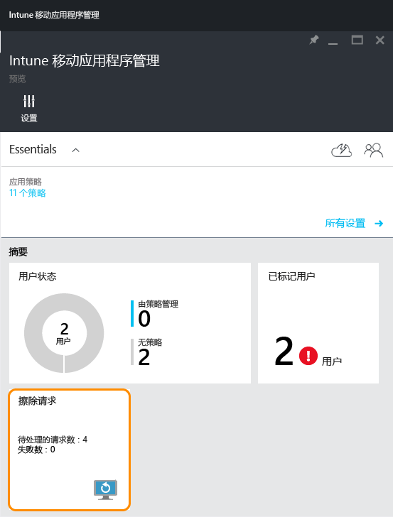
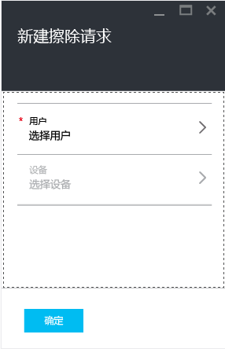
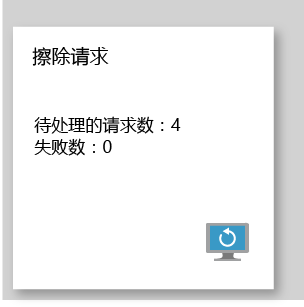

# 使用 Microsoft Intune 擦除托管司应用数据
当设备丢失或被盗，或如果员工离开公司，你想要确保从设备中删除了公司应用数据。 但是，你可能不想删除设备上的个人数据，尤其是如果该设备为员工所有。

若要选择性地删除公司应用数据，请按照本主题中的步骤创建擦除请求。 请求完成之后，应用下次在设备上运行时，会从应用中删除公司数据。
>[!NOTE]
> 将删除从应用直接同步到本机通讯簿的联系人。 无法擦除从本机通讯簿同步到另一个外部源中的任何联系人。 目前仅适用于 Microsoft Outlook 应用。

## 创建擦除请求

1.  在“Intune 移动应用程序管理”边栏选项卡中，选择“擦除请求”磁贴。

    

2.  选择“新建擦除请求”。 这会打开“新建擦除请求”边栏选项卡。

    

3.  选择“用户”以打开“用户”边栏选项卡，然后选择要擦除其应用数据的用户。

4.  选择“设备”。  这会打开“设备”  边栏选项卡，其中列出与所选用户关联的所有设备。  选择要擦除的设备。

5.  你现在已返回“新建擦除请求”边栏选项卡。 选择“确定”以进行擦除请求。 服务会为设备上的每个受保护应用创建并跟踪单独的擦除请求。

## 监视擦除请求
“Intune 移动应用程序管理”  边栏选项卡在“擦除请求”  磁贴上具有汇总报告。  它显示总体状态，并包含挂起的请求数和失败数。 可以按照下述步骤获取更多详细信息：

1.  在“Intune 移动应用程序管理”边栏选项卡中，选择“擦除请求”磁贴打开“擦除请求”边栏选项卡。

2.  在“擦除请求” 边栏选项卡中，可以查看按用户分组的请求列表。 由于系统会为设备上运行的每个受保护应用都创建一个擦除请求，因此对于某个用户，你可能会看到多个请求。 状态指示擦除请求是“挂起” 、“失败”还是“成功”。

用户必须打开应用才能进行擦除，进行请求后可能需要最多 30 分钟才能完成擦除。 

手动删除之前将显示具有挂起状态的擦除。  若要手动删除擦除请求，右键单击并选择“删除”即可。

### 另请参阅
[使用移动应用管理策略保护应用数据](protect-app-data-using-mobile-app-management-policies-with-microsoft-intune.md)

[使用 Azure 门户](azure-portal-for-microsoft-intune-mam-policies.md)

<!--HONumber=Nov16_HO3-->

