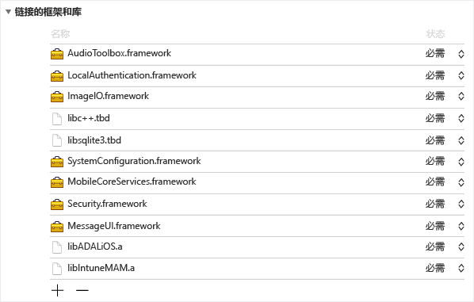
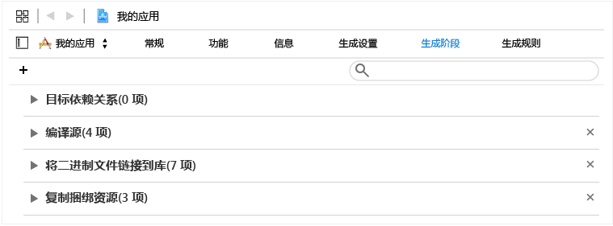
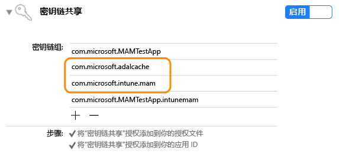

# Microsoft Intune App SDK for iOS 开发人员指南

> [!NOTE]
> 你可能希望首先阅读 [ Intune App SDK 入门指南 ](intune-app-sdk-get-started.md)，该文档介绍了如何为每个受支持的平台上的集成做准备。* 

Microsoft Intune App SDK for iOS 支持将 Intune 移动应用管理 (MAM) 集成到 iOS 应用中。 已启用 MAM 的应用与 Intune App SDK 相集成，允许 IT 管理员在主动管理移动应用时在该应用上部署策略。

## SDK 包含什么

Intune App SDK for iOS 包括一个静态库、资源文件、API 标头、一个调试设置 plist 和一个配置器工具。 移动应用可能只包含资源文件，并且静态链接到库，以便实施大多数策略。 高级的 Intune MAM 功能是通过 API 来实现的。
本指南将介绍集成 Intune App SDK for iOS 时如何使用以下项目：

* **`libIntuneMAM.a`**：Intune App SDK 库。 将此库链接到你的项目，以便启用移动应用的 MAM 功能。 有关说明可以在本文的“使用 Intune App SDK 生成应用”一节中找到。

* **`IntuneMAMResources.Bundle`**：一个资源包，包含 SDK 所依赖的资源。 

* **标头**：用于公开 Intune App SDK API。 如果你使用 API，则需要包括包含该 API 的标头文件。 

## Intune App SDK 的使用方式

Intune App SDK for iOS 的目标是在最大程度上减少代码更改的情况下将管理功能添加到 iOS 应用中。 降低代码更改量可以缩短产品上市时间，并同时提高移动应用的一致性和稳定性。 

需要将应用链接到静态库，并包含资源包。 MAMDebugSettings.plist 文件是可选的，可以包含在此工具包中，以便模拟要应用到应用的 MAM 策略，而无需通过 Microsoft Intune 部署此应用。 此外，在调试版本中，通过 iTunes 文件共享将 MAMDebugSettings.plist 文件传输到应用的 Documents 目录下，这样可以应用 MAMDebugSettings.plist 文件中的策略。

## 使用 Intune App SDK 生成应用 

完成以下步骤来启用 Intune App SDK：

1. 通过执行以下操作链接到 `libIntuneMAM.a` 库：

    将 libIntuneMAM.a 库拖放到项目目标的“链接的框架和库”列表中。  

    
 
    **注意**：要发布到应用商店时，请使用 libIntuneMAM.a 的发行版，而不是调试版。 发行版将在 "release" 文件夹中。 调试版包含详细的输出，这些输出有利于对 Intune App SDK 的问题进行调试。

2. 请向项目中添加以下 iOS 框架（如果没有）。
    * `MessageUI.framework`
    * `Security.framework`
    * `MobileCoreServices.framework`
    * `SystemConfiguration.framework`
    * `libsqlite3.dylib`
    * `libc++.dylib`
    * `ImageIO.framework`
    * `LocalAuthentication.Framework`
    * `AudioToolbox.framework` 

    **注意**：如果此应用针对的是 iOS7，请将 `LocalAuthentication.Framework` 的 "Status" 特性设置为 "Optional"。 

    如果未设置 "Status"，则无法在 iOS7 上启动此应用。

    **注意**：Xcode 7 已将 `.dylib` 扩展名切换为 `.tbd`。

3. 将 `IntuneMAMResources.bundle` 资源包添加到项目，方法是在“生成阶段”将此资源包拖放到“复制资源包”下面。 

    

4. 将 `-force_load {PATH_TO_LIB}/libIntuneMAM.a` 添加到以下任一项，并将 `{PATH_TO_LIB}` 替换为 Intune App SDK 的位置：
    * 项目的 OTHER_LDFLAGS 生成配置设置 
    * UI 的“其他链接器标志” 

    **注意**：要查找 `PATH_TO_LIB`，请选择文件 `libIntuneMAM.a` ，并从“文件”菜单中选择“获取信息”。 复制并粘贴“信息”窗口中“常规”部分的“位置”信息（路径）。

5. 如果你的移动应用的 `info.plist`文件中定义了主要 Nib 或 Storyboard，则请删除 Main Storyboard 或 Main Nib 文件字段。 使用以下键名称（如果适用）在名称为 `IntuneMAMSettings` 的新字典下方添加你之前删除的 Storyboard 或 Nib 的值：
    * `MainStoryboardFile`
    * `MainStoryboardFile~ipad`
    * `MainNibFile`
    * `MainNibFile~ipad `
    
    如果移动应用的 `info.plist`文件中未定义主要 Nib 或 Storyboard，那么这些设置为 **非必需**。 

    **注意**：你可以使用原始格式查看 `info.plist` 文件（目的是查看键名称），方法是右键单击文档正文的任意位置，然后将查看类型更改为“显示原始键/值”。

6. 通过单击每个项目目标的“功能”并启用 Keychain 共享开关，来启用 Keychain 共享（如果尚未启用）。 需要启用 Keychain 共享才能继续执行下一步。

    **注意**：你的配置文件需要支持新的 keychain 共享值。 keychain 访问组应支持通配符。 你可以通过以下方法进行验证：在文本编辑器中打开 `.mobileprovision` 文件，搜索 "keychain-access-groups"，确保其中包含通配符，例如： 

       <key>keychain-access-groups</key>
       <array>
       <string>YOURBUNDLESEEDID.*</string>
       </array>

7. 启用 keychain 共享后，请按照以下步骤创建将在其中存储 Intune App SDK 数据的单独的访问组。 你可以使用 UI 或授权文件创建 keychain 访问组：

    使用 UI 创建 keychain 访问组： 
    
    * 如果你的移动应用没有定义任何 keychain 访问组，则将此应用的程序包 ID 添加为第一个组。
    * 添加共享的 keychain 组 com.microsoft.intune.mam。 Intune App SDK 使用此访问组来存储数据。  
    * 将 `com.microsoft.adalcache` 添加到现有的访问组。 
 
    

    如果你使用授权文件来创建 keychain 访问组，而不是常规的 UI，那么你需要在授权文件的 keychain 访问组前面添加 `$(AppIdentifierPrefix)` 。 例如： `$(AppIdentifierPrefix)com.microsoft.intune.mam` 和 `$(AppIdentifierPrefix)com.microsoft.adalcache`。

    **注意**：授权文件是移动应用独有的 XML 文件，用于指定 iOS 应用中的特殊权限和功能。

8. 对于要为 iOS 9 + 开发的移动应用，需要在移动应用的 `UIApplication canOpenURL` 文件的 `LSApplicationQueriesSchemes` 数组中包括移动应用传递到 `info.plist` 的每个协议。 此外，对于每个列出的协议，需要添加新的协议，并对新协议附加 `-intunemam`。 你还必须在此数组中包括 `http-intunemam`、 `https-intunemam`和 `ms-outlook-intunemam` 。 

9. 如果应用在其 `info.plist file`中定义了 URL 方案，则为每个 URL 方案添加另一个具有 `-intunemam` 后缀的方案。

10. 如果应用在其授权中定义了应用组，则将这些组作为字符串数组添加到 `IntuneMAMSettings` 键下面的 `AppGroupIdentitifiers` 字典中。

11. 将移动应用链接到 ADAL 库。 Objective C 的 ADAL 库[可在 Github 上获取](https://github.com/AzureAD/azure-activedirectory-library-for-objc)。

    **注意**：从 2015 年 6 月 19 日起针对 ADAL 代理分支代码测试了 Intune App SDK。 请确保与 ADAL 库的最新/正在使用的版本进行链接。

12. 在项目中包括 `ADALiOSBundle.bundle resource` 包，方法是在“生成阶段”将此资源包拖放到“复制资源包”下面。

13. 链接到此库时使用 `-force_load PATH_TO_ADAL_LIBRARY` 链接器选项。

    将 `-force_load {PATH_TO_LIB}/libADALiOS.a` 添加到项目的 OTHER_LDFLAGS 生成配置设置或 UI 的“其他链接器标志”。 应将“PATH_TO_LIB”替换为 ADAL 二进制文件位置。 

如果你的移动应用在其身份验证中使用 ADAL，请查看本文中的“配置 Azure 目录身份验证库设置”一节。

### 遥测技术 

默认情况下，Intune App SDK for iOS 记录使用事件的遥测数据，并将其发送到 Microsoft Intune。

将对以下使用事件记录数据： 

1. 应用启动事件，用于帮助 Microsoft Intune 按照管理类型了解已启用 MAM 的应用的使用情况。

2. EnrollApplication API 调用事件，用于帮助 Microsoft Intune 了解客户端的 enrollApplication 调用的成功率和其他各种性能指标。

**注意**：如果你选择不从移动应用中发送 Intune App SDK 遥测数据到 Microsoft Intune，则 **必须禁用** Intune App SDK 遥测数据捕获功能，方法是在 `MAMTelemetryDisabled` 中将属性 `IntuneMAMSettings`。

## 配置 Azure 目录身份验证库 (ADAL) 设置（可选）

Intune App SDK 在其身份验证和条件启动时使用 ADAL。 通常情况下，ADAL 要求应用进行注册并获得唯一的 ID（称为 `ClientID`）和其他标识符，从而确保授予该应用的令牌的安全。 连接 Azure Active Directory 时，Intune App SDK 使用默认的注册值。  如果应用在进行身份验证时使用了 ADAL，那么此应用必须使用其现有的注册值，并覆盖 Intune App SDK 的默认值，从而确保不会提示最终用户进行两次身份验证（一次是由 Intune App SDK 发起的身份验证，另一次是由此应用发起的身份验证）。 

如果应用在身份验证中使用 ADAL，则必须执行下面的步骤。 如果你的移动应用并不依赖于 ADAL，则不需要执行更多操作。 

1. 在项目的 `Info.plist`文件中，在具有键名称 `IntuneMAMSettings` 的 `ADALClientId`字典下面指定要用于 ADAL 调用的 `ClientID` 。 

2. 在项目的 `Info.plist`文件中，在具有键名称 `IntuneMAMSettings` 的 `ADALRedirectUri`字典下面指定要用于 ADAL 调用的重定向 URI。 你可能还需要根据应用的重定向 URI 的格式指定 `ADALRedirectScheme` 。

### 生成扩展（可选） 

生成扩展时，请按照与生成移动应用相同的说明执行操作，如本文的“使用 Intune App SDK 生成应用”一节所述。 此外，更新每个扩展的 info.plist 文件，以便在具有包含应用程序的程序包 ID 的 IntuneMAMSettings 字典下面添加 ContainingAppBundleId 键。

### 生成框架（可选）

在应用了对 Intune App SDK 的最新更改后，如果移动应用包含嵌入的应用程序框架，则无需使用任何特定的链接器标志编译此移动应用。 

### 启动时的图像文件（可选）

当已启用 MAM 的应用由 Microsoft Intune 主动管理时，Intune App SDK 将在应用启动时显示启动屏幕，用于向用户表示此应用已被管理。 你可以选择添加要在“由你的公司管理”启动页面显示的图像文件。 针对图像使用以下准则：

* 在应用的 info.plist 文件中，在具有键名称 `IntuneMAMSettings` 和 `SplashIconFile` 和 `SplashIconFile~ipad`。 

* 图像大小和要求：

    * 对 iPhone 6s Plus 和 iPhone 6 Plus 使用 180 x 180，对其他 iPhone 型号使用 120x120，对 iPad 使用 152x152。 
    
    * 从文件名中删除 `.png` 扩展名 
    
    * 链接到此库时使用 `@2x` 后缀，对 3 倍大小的版本使用 `@3x` 后缀。 如果图像大小不正确，则将对它们进行缩放，使其大小合适。 如果未指定 SplashIconFile 值，则 Intune App SDK 将选择应用的一个图标（对所有 Iphone 选择 60 x 60，对 iPad 选择 76 x 76）。

**注意**：此屏幕由启动触发，但可以由用户永久关闭。

## 配置 Intune App SDK 设置

应用的 `IntuneMAMSettings` 文件中所包含的 `info.plist` 字典用于配置 Intune App SDK。 下面列出了所有支持的设置： 

其中的一些设置可能已在前面各节中提及，一些设置则不适用于所有应用。 

设置  | 类型  | 定义 | 是否必需？
--|--|--|--
ADALClientId  | 字符串  | 应用的 AAD 客户端标识符。 | 如果应用使用 ADAL，则需要此设置。
ADALRedirectUri  | 字符串  | 应用的 AAD 重定向 URI。 | 如果应用使用 ADAL，则需要此设置。 
AppGroupIdentifier | 字符串数组  | 应用的授权 com.apple.security.application 组部分的应用组数组。 | 如果应用使用应用组，则需要此设置。
ContainingAppBundleId  | 字符串 | 指定扩展的包含应用程序的程序包 ID。 | iOS 扩展需要此设置。
MainNibFile MainNibFile ~ ipad  | 字符串  | 此设置应包含应用的主要 nib 文件名。  | 如果应用在其 info.plist 中定义了 MainNibFile，则需要此设置。
MainStoryboardFile MainStoryboardFile~ipad  | 字符串  | 此设置应包含应用的主要 storyboard 文件名。 | 如果应用在其 info.plist 中定义了 UIMainStoryboardFile，则需要此设置。
SplashIconFile~ipad  IntuneMAMSettings  | 字符串  | 指定 Intune 的初始屏幕图标文件。 有关更多信息，请参阅本文的“启动时的图像文件”一节。 | 可选。
SplashDuration | 数字 | 应用启动时显示 Intune 初始屏幕的最小时间（以秒为单位）。 默认值为 1.5。 | 可选。
ADALLogOverrideDisabled | 布尔值  | 指定 SDK 是否将所有 ADAL 日志（包括应用的 ADAL 调用，如果有）路由到它自己的日志文件。 默认值为 NO。 如果应用想要设置其自己的 ADAL 日志回调，则设置为 YES。 | 可选。

## Intune App SDK 的标头 

以下标头包括启用 Intune App SDK 的功能所需的 API 函数调用。 

    IntuneMAMAsyncResult.h
    IntuneMAMDataProtectionInfo.h
    IntuneMAMDataProtectionManager.h
    IntuneMAMFileProtectionInfo.h
    IntuneMAMFileProtectionManager.h
    IntuneMAMPolicyDelegate.h
    IntuneMAMLogger.h

## 在 Xcode 中调试 Intune App SDK

在使用 Microsoft Intune 测试已启用 MAM 的应用之前，可以在 Xcode 中使用 `Settings.bundle` 。 这样，你无需连接到 Intune 就可以设置测试策略。 要启用此功能：

* 右键单击项目的最上层文件夹以添加 `Settings.bundle` 。 从菜单中选择“添加 -> 新建文件”。 在要添加的“资源”下面选择“设置包”模板。

* 仅在调试内部版本中，将 `MAMDebugSettings.plist` 复制到 `Settings.bundle`。

* 在 `Root.plist` （位于 Settings.bundle）中，添加首选项设置 "Type" 子窗格和 "FileName" `MAMDebugSettings`。

* 在“设置 -> 你的应用名称”中，切换“启用测试策略”。

* 启动应用（在 Xcode 内部或外部）。 

* 在“设置 -> 你的应用名称 -> 启用测试策略”中，切换一个策略，例如“PIN”。

* 启动应用（在 Xcode 内部或外部）。 确认 PIN 是否工作正常。

> [!NOTE]
> 现在你可以使用“设置 -> 你的应用名称 -> 启用测试策略”来启用和切换设置。

## 建议使用的 iOS 最佳做法

以下是针对 iOS 进行开发时建议采用的最佳做法：

IOS 文件系统是区分大小写的。 确保文件名的大小写正确，例如 `libIntuneMAM.a` 和 `IntuneMAMResources.bundle`。

如果 Xcode 在查找 `libIntuneMAM.a`时遇到问题，可以通过将此库的路径添加到链接器搜索路径来解决此问题。

<!--HONumber=Sep16_HO2-->

