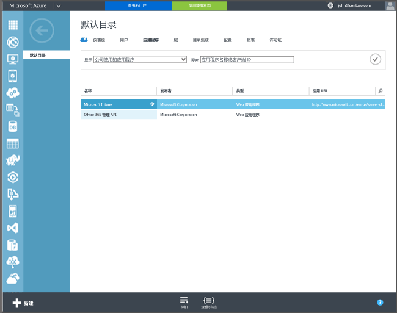

## Azure Active Directory 注册

自动注册可以让用户通过添加工作或学校帐户并同意进行管理的方式，在 Intune 中注册公司所有或个人 Windows 10 电脑和 Windows 10 移动版设备。 就这么简单。 在后台，该用户的设备进行注册并加入 Azure Active Directory。 注册后，使用 Intune 管理设备。

**必备条件**
- Azure Active Directory Premium 订阅（[试用订阅](http://go.microsoft.com/fwlink/?LinkID=816845)）
- Microsoft Intune 订阅

### 配置自动 MDM 注册

1. 在 [Azure 管理门户](https://manage.windowsazure.com) (https://manage.windowsazure.com) 中，导航到“**Active Directory**”节点并选择你的目录。

2. 单击“**应用程序**”选项卡，可以在应用程序列表中看到 **Microsoft Intune**。

    

3. 单击 **Microsoft Intune** 的箭头，可以看到用于配置 Microsoft Intune 的页面。

4. 单击“**配置**”开始使用 Microsoft Intune 配置自动 MDM 注册。

5. 为 Intune 指定 URL：

  - **MDM 注册 URL** – 使用默认值。
  - **MDM 使用条款 URL** – 使用默认值。 在注册设备时，此 URL 将显示用户的使用条款。
  - **MDM 合规性 URL** – 使用默认值。 如果发现设备不合规，此 URL 会显示“**拒绝访问**”消息。 此 URL 指向的页面可帮助用户了解其设备为何不符合策略规范，以及如何可以将其恢复为合规。

6.  指定应由 Microsoft Intune 管理的用户的设备。 这些用户的 Windows 10 设备将自动注册，以使用 Microsoft Intune 进行管理。

  - **所有**
  - **组**
  - **无**

7. 选择“保存”。

<!--HONumber=Jan17_HO1-->

