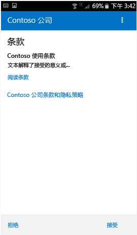
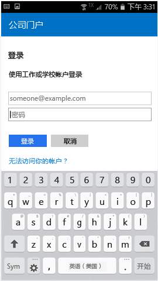
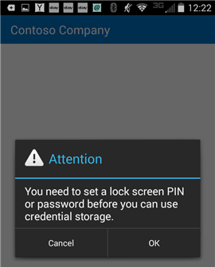

# 通过公司门户注册设备  
注册个人或公司拥有的 Android 设备，以安全访问公司电子邮件、应用和数据。 公司门户支持 Android 设备，包括运行 Android 4.4 及更高版本的 Samsung Knox。  
 
> [!VIDEO https://www.youtube.com/embed/k0Q_sGLSx6o?rel=0]

> [!NOTE]
> Samsung Knox 是一种安全解决方案，一些 Samsung 设备用它来提供本机 Android 无法提供的额外保护。 若要检查是否是 Samsung Knox 设备，请依次转到“设置” > “关于设备”   。 如果其中没有列出“Knox 版本”，表明使用的是本机 Android 设备  。

## 注册设备  
请确保[从 Google Play 安装免费的 Intune 公司门户应用](https://play.google.com/store/apps/details?id=com.microsoft.windowsintune.companyportal)。 

注册过程中，系统可能会要求你选择最能说明如何使用设备的类别。 公司支持人员使用你的答案来检查可以访问的应用。  

1. 打开公司门户应用。  

3. 在公司门户的“欢迎”  屏幕上，点击“登录”  ，然后使用你的工作或学校帐户登录。

      

4. 如果系统提示你接受组织的条款和条件，请点击“接受”  。 此屏幕可能与以下示例屏幕截图略有不同。 

   

5. 使用你的工作或学校帐户和密码登录公司门户应用，然后点击“登录”  。

   

6. 在“公司访问设置”  屏幕上，点击“继续”  。

   

   > [!NOTE]
   > 黄色三角形并不意味着发生了错误。 这些图标指示注册过程中仍存在需要完成的步骤。

7. 查看公司支持人员在你的设备上可以看到和不可以看到的内容的列表，然后点击“继续”  。

   

8. 在“接下来会发生的情况”屏幕上，阅读注册期间会发生的情况，然后点击“注册”   。

   

9. 如果在使用 Android 6.0 或更高版本，则执行此步骤。 否则，请转到下一步。

   如果公司支持人员设置了特定策略，则你可能会看到以下消息：
   - **是否允许公司门户发起和管理电话呼叫?**

     

   如果看到此消息，请点击“允许”  。 点击“允许”是安全的，因为 **Microsoft 绝不会发起或管理电话呼叫**！ 消息文本由 Google 管控，Microsoft 无法更改。 允许访问时，只需让设备将设备的国际移动台设备标识 (IMEI) 编号发送给 Intune。 IMEI 编号类似于序列号，可唯一地标识移动设备。

   如果拒绝访问，则在下次登录公司门户时，系统将再次显示该消息。 要关闭后续消息，请选择“不再询问”  。 要撤消访问权限，请转到“设置” > “应用” > “公司门户” > “权限” > “电话”，然后开启权限      。  

   - **是否允许公司门户访问你的联系人？**

     

     如果看到此消息，请点击“允许”  。 点击“允许”是安全的，因为 **Microsoft 绝不会访问你的联系人！** 消息文本由 Google 管控，Microsoft 无法更改。 当你允许访问时，它只允许公司门户应用创建、使用和管理你的工作账户。

     如果拒绝访问，下次登录到公司门户时将再次出现此消息，但是你可以点击“不再询问”  框关闭以后接收此消息。 如果你稍后决定允许访问，请转到**设置** &gt; **应用** &gt; **公司门户** &gt; **权限** &gt; **手机**，然后开启权限。

10. 在“激活设备管理员”  屏幕上，点击“激活”  。

    

    公司门户需要通过设备管理员角色来管理设备。 它允许管理员查看某些信息（如解锁屏幕的失败尝试次数）以及执行部分操作。    

    Microsoft 不会控制此消息，而且我们知道其措辞可能看起来有点极端。 公司门户无法仅显示与你的组织相关的限制和访问权限。 所有权限会同时在屏幕上授予。 如果你对某个组织的使用存在疑问，请使用[公司门户网站](https://go.microsoft.com/fwlink/?linkid=2010980)中的联系信息与公司支持人员联系以获取更多信息。  

11. 按照提示输入 PIN 或密码。 如果已经在此设备上设置 PIN 或密码，将不会显示此屏幕或要求你输入新的 PIN 或密码。  

    

12. 如果你使用的是 Samsung Knox 设备，请点击“确认”  ，你将看到一条指示正在注册设备的消息。 如果你使用的是本机 Android 设备，则只需注意下面的屏幕，其中显示正在注册设备。

    

    此屏幕显示正在注册设备。

    

13. “公司访问设置”  屏幕出现时，点击“继续”  。 如果消息指示你的设备不兼容，请按照说明修复该问题，然后点击“继续”  。

    

    

    可以通过点击问题了解有关详细信息。

    

      

14. 在“公司访问设置完成”  屏幕上，点击“完成”  。 你的设备现已注册。

    

## 后续步骤  

你需转到“设置” > “安全性”，然后打开“未知源”才能尝试安装公司应用    。 如果你在尝试安装应用前未打开此选项，则会看到以下消息：“已阻止安装”。 出于安全性考虑，你的设置已被设置为阻止安装未知来源的应用。” 你可点击错误对话框上的“设置”  以转到“未知来源”  选项。  

> [!Note]
> 如果组织使用的是电信费用管理软件，则还需要完成其他几个步骤才能完全注册设备。 请单击[此处](enroll-your-device-with-telecom-expense-management-android.md)，查看详细信息。

如果尝试在 Intune 中注册设备时遇到错误，则可以[向公司支持人员发送电子邮件](send-logs-to-your-it-admin-by-email-android.md)。  

仍需帮助？ 请联系公司支持人员（访问[公司门户网站](https://go.microsoft.com/fwlink/?linkid=2010980)获取联系信息），或写邮件给 <a href="mailto:wintunedroidfbk@microsoft.com?subject=I'm having trouble with enrolling my Android device&body=Describe the issue you're experiencing here.">Microsoft Android 团队</a>。
