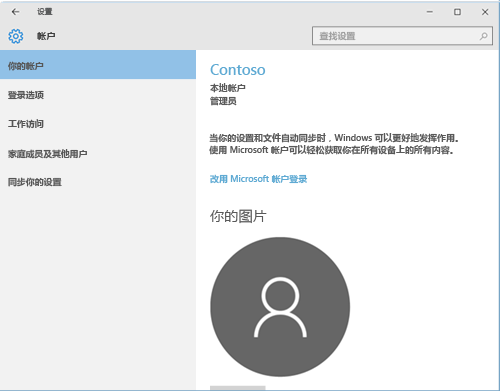
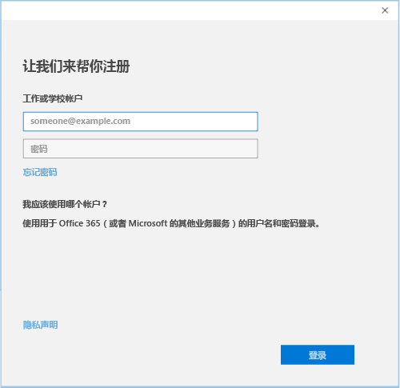

# 使用 Intune 公司门户注册 Windows 10 设备

使用 Intune 公司门户来注册 Windows 10 设备在贵组织的管理下。 本文介绍如何注册 Windows 10 版本 1607年及更高版本、 和 Windows 10 版本 1511年及更早版本的设备。 在开始之前，请确保您[验证你的设备上的版本](windows-enrollment-company-portal.md#find-windows-10-version-number)，以便可以按照正确的步骤。  

跨各种设备类型，包括桌面、 手机和平板电脑支持 Windows 10。 注册步骤是使用任何设备上相同的。 但是，您的屏幕可能看起来稍有不同于在本文中所显示的图像。  

> [!VIDEO https://channel9.msdn.com/Series/IntuneEnrollment/Windows-Enrollment/player]  

## 注册 Windows 10 版本 1607年及更高版本的设备 
以下步骤介绍如何注册 Windows 10，版本 1607年及更高版本运行的设备。  

1. 转到“开始”。 如果是 Windows 10 移动版设备，则继续**所有应用**列表。

2. 打开“设置”应用。 如果应用不容易获得在应用列表中，请转到搜索栏和类型"设置。

3. 选择“帐户” > “访问工作或学校” > “连接”。  

      

4. 输入工作或学校电子邮件地址，然后选择“下一步”。  

     

5. 使用你的工作或学校帐户登录 Intune。  

      

    你最后会看到一条显示你的公司或学校正在注册你的设备的消息。

6. 如果你的组织要求你设置 PIN 的 Windows Hello，将提示您输入验证码。 输入代码，然后继续完成屏幕上的步骤创建 pin 码。  

7. 在“设置完成!”上 屏幕，请选择“完成”。 你的设备现已注册。  

8. 要仔细检查你的连接，请返回到**设置** > **帐户** > **访问工作或学校**。  现在应列出你的帐户。  

      

仍无法访问工作或学校电子邮件、文件或其他数据？ 了解如何[疑难解答帐户](troubleshoot-your-windows-10-device-windows.md#troubleshooting-steps-to-follow-if-you-see-access-work-or-school)。  

## 注册 Windows 10 版本 1511年和早期的设备  
以下步骤介绍如何注册 Windows 10 版本 1511年及更早版本运行的设备。  

1. 转到“开始”。 如果是 Windows 10 移动版设备，则继续**所有应用**列表。

2. 打开“设置”应用。 如果应用不容易获得在应用列表中，请转到搜索栏和类型"设置。

3. 选择**帐户** > **你的帐户**。  

      

5. 选择“添加工作单位或学校帐户”。  

      

6. 使用工作单位或学校凭据登录。  

      

仍无法访问工作或学校电子邮件、文件或其他数据？ 了解如何[疑难解答帐户](troubleshoot-your-windows-10-device-windows.md#troubleshooting-steps-to-follow-if-you-see-your-account)。   

## 后续步骤  

若要获取帮助，请联系公司支持人员。 您可以找到你的组织的 IT 信息[公司门户网站](https://go.microsoft.com/fwlink/?linkid=2010980)。 使用你的工作或学校帐户登录到网站。  

 

