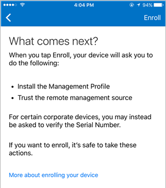

# 在 Intune 中注册 iOS 设备

如果你的公司或学校使用 Microsoft Intune，则可以注册 iOS 设备以获取对公司电子邮件、文件和其他资源的访问权限。 注册设备时，IT 部门可以管理这些工作或学校资源，使其保持安全，并使你可以自由地使用首选设备来完成工作。 若要了解有关注册的详细信息，请参阅[安装公司门户应用并在 Intune 中注册设备后会发生什么？](what-happens-if-you-install-the-company-portal-app-and-enroll-your-device-in-intune-ios.md)

> [!VIDEO https://channel9.msdn.com/Series/IntuneEnrollment/iOS-Enrollment/player]

> [!NOTE]
> 如果正在邮件应用中尝试访问公司电子邮件，很可能已收到提示，要求管理设备以确保其安全。 按照下面的说明，获取对 iOS 设备上的电子邮件和其他公司资源的访问权限。

**准备工作：**

- 确保在开始步骤之后完成注册。 暂停超过几分钟后，通常会停止该过程，并需要重启。
- 如果出于任何原因注册失败，则需返回公司门户应用以重试。
- 确保 Wi-Fi 正常工作。 否则，注册将失败。
- 如果在设备上阻止了 Safari，请对其解除阻止。 设备注册过程中，需要使用 Safari。

**注册 iOS 设备：**

1.  按照[安装 Intune 公司门户应用并登录](install-and-sign-in-to-the-intune-company-portal-app-ios.md)中的步骤操作。

2. 在**公司访问设置**页上，点击**开始**。

    

3. 在**为什么要注册设备？**屏幕上，阅读注册设备时你可以执行的操作，然后点击**继续**。

    

  > [!NOTE]
  > 黄色三角形并不意味着发生了错误。 这些图标指示注册过程中仍存在需要完成的步骤。

4. 查看 IT 管理员在你的已注册设备上可以看到和不可以看到的内容的列表，然后点击“继续”。

    

5.  在**接下来会发生的情况**屏幕上，阅读注册期间会发生的情况，然后点击**注册**。

    

6.  在“安装配置文件”屏幕上，点击“安装”，并根据系统提示输入你的密码。

    

7.  点击“安装”。

        

8.  点击“安装”以表示你已阅读警告。

    

9.  点击“信任”。

    

10.  当屏幕更改为显示配置文件已完成安装时，点击**完成**。

    

    “正在注册设备”消息会显示在屏幕上。

11.  当消息询问是否要在公司门户中打开页面时，点击“打开”。

    

12. 在“公司访问设置”屏幕上，点击“继续”。 此屏幕显示使设备符合要求需执行的其他操作，例如设置密码。 请按照屏幕上的说明操作，直至满足所有符合性要求。 完成后，返回“公司访问设置”屏幕。 点击“继续”。

    

13. 点击“完成”。

    

你的设备现已在 Intune 中注册，你会返回到公司门户应用。

> [!Note]
> 在完成设备注册前，还有几步要做。 了解关于[使用电信费用管理注册设备](enroll-your-device-with-telecom-expense-management-ios.md)的详细信息。 如果组织正在使用 Apple 的设备注册计划，请在[此处](enroll-your-device-dep-ios.md)了解详细信息。

仍需要帮助？ 请与 IT 管理员联系。有关联系信息，请查看[公司门户网站](http://portal.manage.microsoft.com)。
