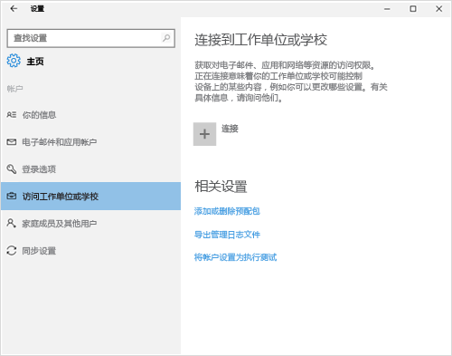
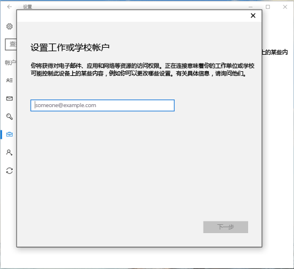
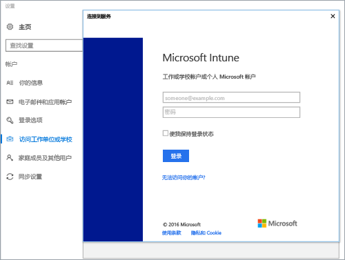
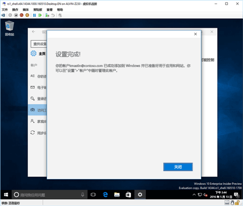
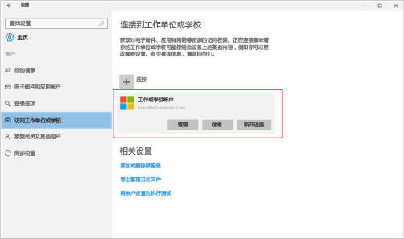

# 在 Intune 中注册 Windows 10 设备

> [!NOTE]
> Windows 10 适用于所有类型的设备。 无论使用台式电脑、手机还是平板电脑，所遵循的步骤都相同，但是这些步骤可能与此页面上的图像略有差异。

<iframe src="https://channel9.msdn.com/Series/IntuneEnrollment/Windows-Enrollment/player" width="960" height="540" allowFullScreen frameBorder="0"></iframe>

1. 转到“开始”。

  - 如果使用 Windows 10 桌面版设备，请转到“开始”菜单。
  - 如果使用 Windows 10 移动版设备，请转到“开始”屏幕，然后轻扫至“所有应用”列表。

2.  通过在搜索栏中搜索“设置”，打开 Windows“设置”应用。

3. 选择“帐户” > “访问工作或学校” > “连接”。

    

3.  输入工作或学校电子邮件地址，然后选择“下一步”。

    

4. 使用你的工作或学校帐户登录 Intune。

    

    你将看到指示你的公司或学校正在注册你的设备的消息。

5. 当你看到**设置完成!** 屏幕，选择“关闭”。 大功告成。

  

6. 如果要再次确认是否已正确连接，请返回到“**设置**”，现在应该可以看到列出的工作或学校帐户。

    

如果执行了之前的步骤，但仍无法访问你的工作或学校电子邮件帐户和文件，请按照[看到“访问工作单位或学校”时要执行的故障排除步骤](troubleshoot-your-windows-10-device-windows.md#troubleshooting-steps-to-follow-if-you-see-access-work-or-school)中的步骤操作。
