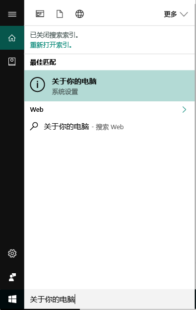
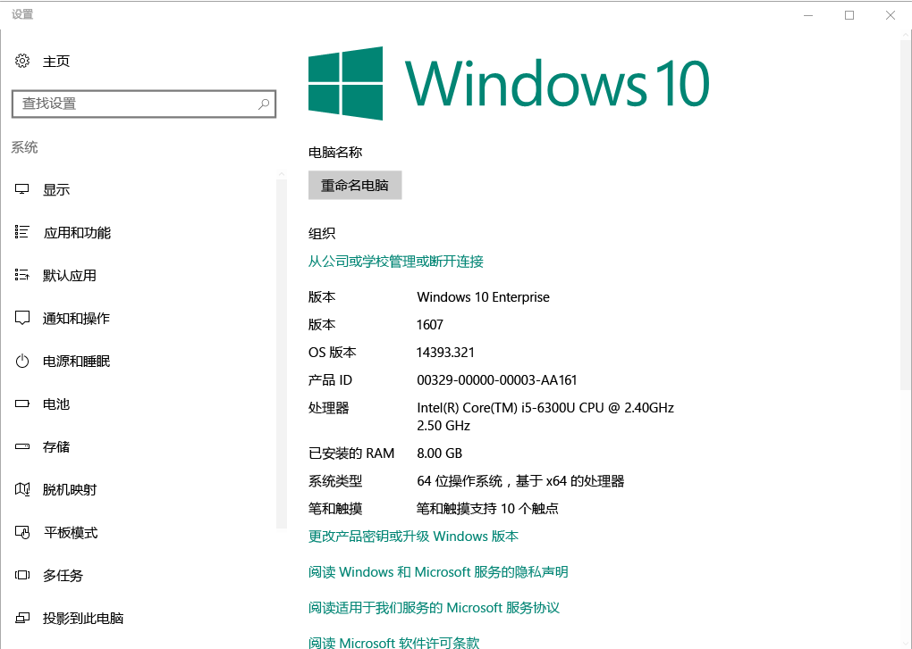

# 在 Intune 中注册 Windows 10 设备

在 Microsoft Intune 中注册设备可使 Windows 10 设备获取访问组织安全数据（包括电子邮件、文件和其他资源）的权限。 这适用于 Windows 10 桌面设备和 Windows 10 移动设备。 注册设备有助于为你和你的组织确保这类访问的安全，且有助于将工作数据与个人数据分开。

想要了解更多信息？ 了解[在 Intune 中注册设备](what-happens-if-you-install-the-company-portal-app-and-enroll-your-device-in-intune-windows.md)后会发生的情况，以及这对[设备上的信息](what-info-can-your-company-see-when-you-enroll-your-device-in-intune.md)的意义。

## Windows 10 桌面设备

1. 转到“开始”。

2. 在“搜索栏”键入“关于电脑”，然后选择“关于电脑”。

 

3.  在“设置”中，会看到安装在电脑上的 Windows 10 版本的相关信息列表。 在此列表中，找到“版本”。

 

4.  如果是 1607 或更高版本，请继续[这些步骤](enroll-your-w10-device-access-work-or-school.md)。 如果是 __1511 或更低版本__，请继续[这些步骤](enroll-your-w10-device-your-account.md)。

## Windows 10 移动设备        

1.  在“开始”中，轻扫到“所有应用”列表，然后选择“设置”应用。        
2.  点击“系统”，然后点击“关于”。       
3.  在“设备信息”下，点击“详细信息”。 你会看到有关设备的信息列表。 在此列表中，找到“版本”。        
4.  如果是 1607 或更高版本，请继续[这些步骤](enroll-your-w10-device-access-work-or-school.md)。 如果是 __1511 或更低版本__，请继续[这些步骤](enroll-your-w10-device-your-account.md)。

仍需帮助？ 请与公司支持人员联系。 有关他们的联系信息，请查看[公司门户网站](https://portal.manage.microsoft.com#HelpDeskDialog)。
