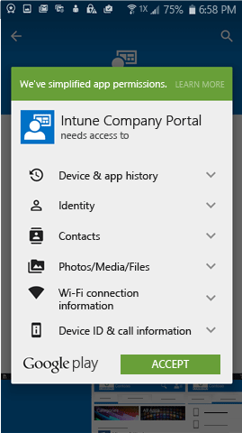

# 安装 Android 适用的公司门户应用

公司门户应用使你可以访问公司或学校的应用、电子邮件和 Internet 连接。 此应用可通过保护你的设备安全来帮助保护组织信息的安全 - 例如保持公司应用处于最新版本，或确保设备在一段特定时间后自行锁定。 公司门户应用实现此目的的方式是帮助你[在 Microsoft Intune 中注册设备](what-happens-if-you-install-the-company-portal-app-and-enroll-your-device-in-intune-android.md)。

1.  点击“主页” > “Play Store”。

2.  在“**搜索**”框中，键入 **intune 公司门户**。

3.  点击“Intune 公司门户”。

    

4.  点击“安装”。

    

5.  点击“接受”。

    

下载公司门户应用后，建议[在 Intune 中注册设备](enroll-your-device-in-Intune-android.md)以便获取工作信息的完全访问权限。 还可以[使用另一台设备登录](https://docs.microsoft.com/intune-user-help/sign-in-to-the-company-portal#signing-in-from-another-device)。

仍需要帮助？ 请与公司支持人员联系。 有关联系信息，请查看[公司门户网站](https://portal.manage.microsoft.com#HelpDeskDialog)。
