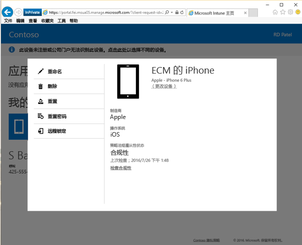

# 如何从公司门户网站重置设备密码

如果丢失了设备 PIN 或在 Intune 中注册的设备的密码，则可以使用[公司门户网站](http://portal.manage.microsoft.com)进行重置。 可使用公司门户网站管理在 Intune 中注册的计算机和设备，还可以用于执行大多数使用公司门户应用时执行的相同任务。

> [!NOTE]
> 很可能你在公司门户网站中看不到“重置密码”按钮。 如果看不到该按钮，将需要联系 IT 管理员以通过公司门户网站获得支持。

重置密码：

1.    在[公司门户网站](http://portal.manage.microsoft.com)上，点击“菜单”按钮，然后选择“我的设备”。

2. 在“我的设备”页上，选择想要重置密码的设备名称。

  

3.    设备将在弹出窗口中打开。 选择“重置密码”按钮。

    

4.  系统会显示横幅，询问你是否确定要重置密码并在重置密码后从设备中注销。 然后，需要等待 5 分钟后才能重新登录。

  

5.  选择“注销”，将收到最后一条消息，告知你已删除设备中的密码。 如果设备未在身边，请勿删除密码，因为对设备具有物理访问权限的任何人将能够访问设备上的大部分信息（个人或公司信息）。 

  

  不同的设备具有不同的密码类型。

  **Android**：删除现有密码，然后使用字母和数字创建临时密码

  **iOS**：删除现有密码且不创建临时密码。 如果你使用 Touch ID 指纹扫描仪打开设备或购买商品，你将需要再次设置。

  **Windows 10 移动版**：删除现有密码，然后使用字母和数字创建临时密码。 使用 Windows Hello 面部识别进行登录时仍然受支持。
    
  **Windows Phone 8.1**：删除现有密码，然后使用数字创建临时密码

  对于 Android 和 Windows 设备，临时密码将显示在“设备详细信息”中。 

6.  解锁设备，然后通过转到设备上的“设置”来设置新密码或更改临时密码。

若要查看确认密码已重置成功的通知，请单击公司门户网站右上角的通知标志。

仍需要帮助？ 请与 IT 管理员联系。 有关联系信息，请查看[公司门户网站](http://portal.manage.microsoft.com)。

