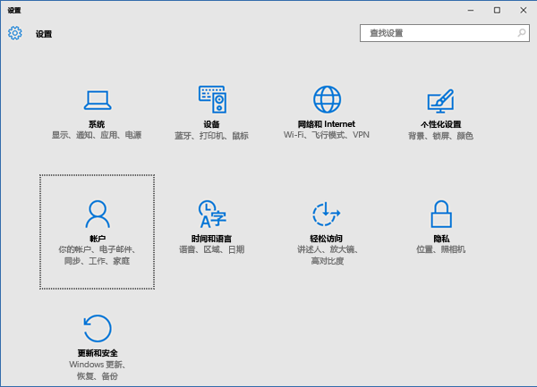
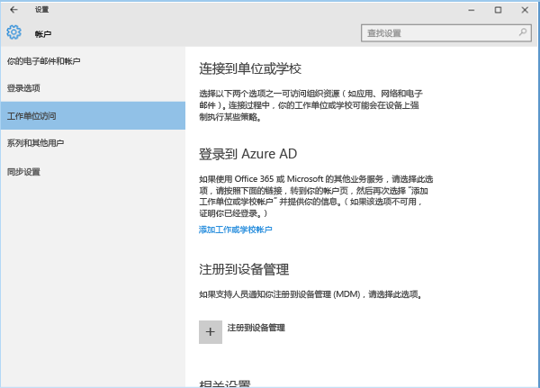
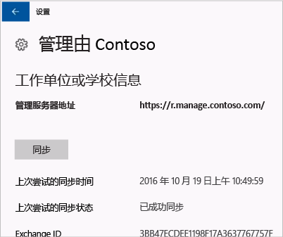
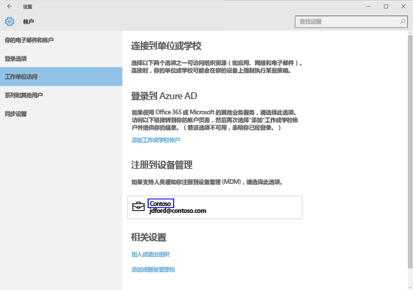
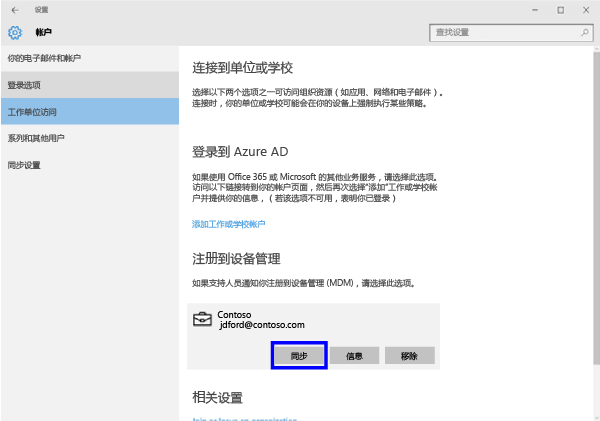
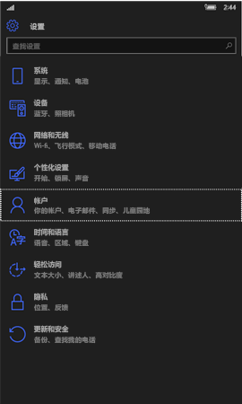
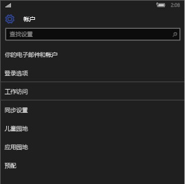
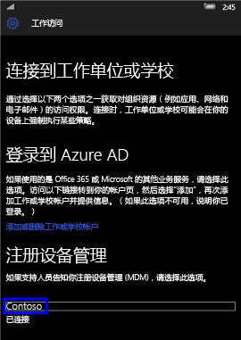
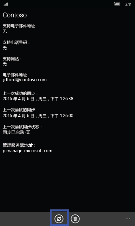
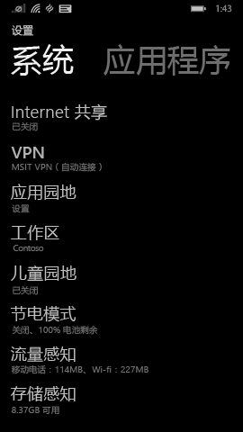

# 手动同步 Windows 设备

有时在 Windows 设备上尝试安装应用可能会比预计时间长。 如果发生这种情况，可尝试手动同步 Windows 设备。 同步可能会帮助提高安装速度。

> [!Note]
> 如果网络速度较慢或同时下载内容的设备数量较多，应用可能需要一段时间才能完成安装。

以下 Windows 版本可手动同步。 遗憾的是，如果设备使用的是其他版本的 Windows，则无法启动手动同步。

* [同步 Windows 10 桌面版](#windows-10-desktop)
* [同步 Windows 10 移动版](#windows-10-mobile)
* [同步 Windows Phone 8.1](#windows-phone-81)

## Windows 10 桌面版
由于存在多个 Windows 10 版本，因此有两组步骤。 若要了解使用哪组步骤，可查看屏幕截图，然后按照设备上显示的步骤执行操作。

1. 选择“启动”按钮，然后选择“设置”。

    

2. 在“设置”页上，选择“帐户”。

    

3. 查看接下来的两个屏幕，并找到与你在设备上看到的屏幕相似的屏幕。 按照与你在设备上看到的屏幕相匹配的步骤操作。

    如果看到显示有“访问工作单位或学校”的此屏幕，请按照[看到“访问工作单位或学校”时要执行的步骤](#steps-to-follow-if-you-see-access-work-or-school)中的说明操作。

    

    如果看到显示有“工作单位访问权限”的此屏幕，请按照[看到“工作单位访问权限”时要执行的步骤](#steps-to-follow-if-you-see-work-access)中的步骤操作。

    

### 看到“访问工作单位或学校”时要执行的步骤

1. 在“帐户”页上，选择“访问工作单位或学校”。

    

2. 选择工作或学校帐户。 根据 IT 管理员的设置方式，可能会看到与以下示例中类似的两个帐户。 一个帐户旁有一个公文包，另一个帐户旁有一个 Microsoft 徽标。

    - 如果看到带有公文包的帐户，请选择它，并找到下面的“信息”按钮。
    - 如果只看到带有 Microsoft 徽标的帐户，请选择该帐户，并找到下面的“信息”按钮。

    

3. 选择“信息”按钮。 将打开一个与以下示例中类似的对话框。

    

4. 选择“同步”按钮。 设备将与 Intune 进行同步。

### 看到“工作单位访问权限”时要执行的步骤

1. 在“帐户”页上，选择“工作单位访问”。

    

2. 在“注册到设备管理”部分下，选择你的公司名称。

    

3. 选择“同步”按钮。

    

   在同步完成之前，该按钮将变为灰显。

### Windows 10 移动版
若要手动同步你的 Windows 10 移动设备，以加快较慢的应用安装的速度：

   1. 请转到**所有应用**  >  **设置**  >  **帐户**。

       

   2. 选择“工作单位访问”。

       

   3. 在“注册到设备管理”下，选择你的公司名称。

       

   4. 选择“同步”图标。

       

       屏幕顶部将显示“我们正在同步你的帐户”消息。 设备完成同步前，“同步”按钮将灰显。

## Windows Phone 8.1
若要手动同步你的 Windows Phone 8.1 设备，以加快较慢的应用安装的速度：

1. 请转到**所有应用**  >  **设置**  >  **工作区**。

    

2. 选择你的公司名称。

    

3. 选择“同步”图标。

    

   设备完成同步前，屏幕顶部将显示“我们正在同步你的帐户”消息。

仍需要帮助？ 请与 IT 管理员联系。 有关联系信息，请查看[公司门户网站](http://portal.manage.microsoft.com)。

