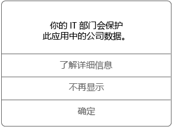

# 在 Android 设备上使用托管应用
配置托管应用，以满足组织的安全要求，并保护工作和学校数据。 这些应用面向设备提供，以供自动安装和使用。 

接收和安装托管应用之前，由组织配置其权限。 它们可能会限制应用的功能或用户交互，以防止应用数据被共享或由未经授权的个人查看。 例如，组织可以阻止在应用中使用复制和粘贴功能。 或者，它们可以限制将数据保存到设备的本地存储中。

若要最大程度加强数据保护，组织可能需要配置多个托管应用协同工作。 例如：
1. 使用托管浏览器应用（例如 Microsoft Edge）连接到组织网络。
2. 单击链接打开对等方的演示文稿文件。
3. 相应的托管应用，如用于打开文件的 Microsoft PowerPoint。

组织可要求使用托管应用执行某些操作，例如打开工作文件，或访问 Web 链接。 如果没有应用，可能无法继续任务。 部分托管应用可供安装，但不是必需的。

## 如何知道我使用的是托管应用？
首次访问托管应用中的工作或学校数据时，将收到一条消息，类似于下面的示例屏幕截图。 消息将提示你重启应用以继续。

## 常用托管应用  
学校或工作场所中通常必需或可用的托管应用示例包括：

-   Microsoft Edge

-   Microsoft Outlook

-   Microsoft Word、Excel 和 PowerPoint

## 如何获取托管应用？
首先，需要安装公司门户，并且如果需要，请将设备纳入管理。 之后，可通过三种方式获取托管应用。
* 注册时，组织将自动向你的设备安装应用。 若要了解注册相关信息，请参阅[在 Intune 中注册设备](enroll-your-device-in-Intune-android.md)。
* 组织在公司门户中提供托管应用。 转到“公司门户”应用或网站，搜索、查看和安装这些应用。 
* 从 Google Play 商店安装应用，然后使用工作或学校帐户登录应用。  

 ## 可用应用   
 贵组织会选择适合在工作中或学校里使用的应用。 这些应用是在公司门户中仅能找到的应用。   

 也可以根据设备类型使用应用。 例如，如果使用适用于 Android 的公司门户应用，则可以访问 Android 应用，但不能访问 iOS 应用。   

 ## 请求用于工作或用于学校的应用   
 如果未在公司门户中找到需要的应用，则可以请求该应用。 在公司门户应用的“联系 IT”选项卡中查找“支持人员”的联系详情。可以在[公司门户网站](https://go.microsoft.com/fwlink/?linkid=2010980)中找到相同的联系详情。   

## 我的公司支持人员可管理应用中的哪些内容？  
以下列表描述公司支持人员可以在应用内管理的设置。 这些设置将影响查看、访问或使用设备上工作或学校数据的方式：

* 对特定网站的访问  

* 使用 Microsoft Edge 和 Azure Active Directory 代理访问公司内部网站  

* 最低应用版本，最低 OS 版本

* 应用之间共享和传输数据的功能  

* 如何以及在何处保存文件  

* 复制和粘贴功能  

* PIN 访问要求  

* 如何使用公司凭据登录  

* 将数据备份到云的功能  

* 截取屏幕截图的能力  

* 数据加密要求  

有关设备上的托管应用的详细信息，请与公司支持人员联系。 有关联系信息，请查看[公司门户网站](https://go.microsoft.com/fwlink/?linkid=2010980)。
